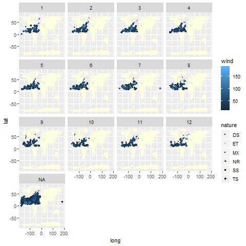

```{r setup, include=FALSE}
knitr::opts_chunk$set(echo = TRUE)
```

```{r echo = FALSE}
# launch package
library(dplyr)
library(readr)
library(ggplot2)
library(maps)
library(lubridate)
```

# Import data set
We downloaded data from online for year 2010-2015. Then, we combine five datas into one files, containing only the first 12 columns. So, the imported data is storms, data containing 12 elements, happened between year 2010-2015.\
In this data set, there are some missing values in "-999","-1.0", and "0.0". We will represent these with NA,and ignore these NAs in the future calcualtion. 

```{r echo = FALSE}
dat <- read_csv("../data/ibtracs-2010-2015.csv",
         col_names=c("serial_num","season","num","basin","sub_basin","name","iso_time","nature","latitude","longitude","wind","press"),
         col_types=list(col_character(), col_integer(), col_character(), col_factor(), col_character(), col_character(), col_character(), col_character(), col_double(), col_double(), col_double(), col_double()),
         na=c("-999","-1","0"),
         skip = 1
         )
```

# _What is the number of (unique) storms in each year?_
We are interested in how many unique storms in each year.We will look at the overal  data first and then find data for each year. So,we can have a better understanding about the frequency of the storms. 
```{r echo=FALSE}
length(unique(dat$serial_num))
length(unique(dat$name))
count(dat,dat$season,dat$name)
count(dat,dat$season,dat$serial_num)
```
It shows the unique storms of each year with the frenquencies.Overall, there are 578 unique storms in 512 names happened between 2010-2015.Then we get data table showing either the name of the storms or the serial number of the storms. 

# _What is the total number of storms per hemisphere (North and South)?_
After we analyze the data based on the year, we are interested in knowing more about the storms, more geogrphically, happened per hemisphere (North and South). We are going to count the stroms data based on hemisphere.
```{r echo=FALSE}
count(filter(dat, latitude < 0))
count(filter(dat, latitude > 0))
count(filter(dat, latitude == 0))
intersect(filter(dat,latitude >0),filter(dat,dat$latitude <0))
```
After seeing the data, we can conclude that:7292 storms happened in the North, 12703 happened in the South and no storms happened on equator.And there are no stroms passing by the equator. 

# _Extreme value_
Next, we are going to find out the max/min value of the wind speed and wind pressure. W are curious about the spped and the pressure since  from that we can predict the damage casued by these storms. 
```{r echo=FALSE}
max(dat$wind,na.rm=TRUE)
min(dat$wind,na.rm=TRUE)
max(dat$press,na.rm=TRUE)
min(dat$press,na.rm=TRUE)
```
From the data above, we can know that the maximum wind speed is 185, and minimum wind speed is 3. The max wind pressure is 1017 and minimum wind pressure is 872.

# _Storms with speed more than 35 knots (tropical storms)_
```{r echo=FALSE}
distinct(filter(dat,dat$wind>=35))
```
From the above table, we can see the unique serial number of storms which speed is over 35 knots. 

# _Storms over the world_
We are going to see the overall storms on the world map tot see the distribute of the storms. We will use a white background and blue poits for the graph.
```{r echo=FALSE}
map(interior = TRUE,bg="white")
points(dat[, c("longitude", "latitude")], col = "blue")
abline(h = 0, lty = 2, col = "red")
title(main="Storms")
```

# _Graph to visualize the storms in the basins EP (Eastern Pacific) and NA (North Atlantic), facetted by year_
```{r echo =FALSE,fig.align='center'}
knitr::include_graphics('../images/map-ep-na-storms-by-year.png')
```

# _Graph to visualize the storms in the basins EP (Eastern Pacific) and NA (North Atlantic), facetted by month_
```{r echo =FALSE,fig.align='center'}

```