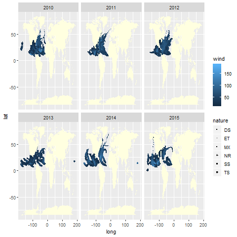
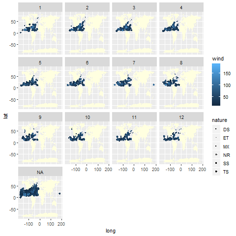

workout1-anqi-chen
================

    ## 
    ## Attaching package: 'dplyr'

    ## The following objects are masked from 'package:stats':
    ## 
    ##     filter, lag

    ## The following objects are masked from 'package:base':
    ## 
    ##     intersect, setdiff, setequal, union

    ## 
    ## Attaching package: 'lubridate'

    ## The following object is masked from 'package:base':
    ## 
    ##     date

# Import data set

We downloaded data from online for year 2010-2015. Then, we combine five
datas into one files, containing only the first 12 columns. So, the
imported data is storms, data containing 12 elements, happened between
year 2010-2015.  
In this data set, there are some missing values in “-999”,“-1.0”, and
“0.0”. We will represent these with NA,and ignore these NAs in the
future calcualtion.

# *What is the number of (unique) storms in each year?*

We are interested in how many unique storms in each year.We will look at
the overal data first and then find data for each year. So,we can have a
better understanding about the frequency of the storms.

    ## [1] 578

    ## [1] 512

    ## # A tibble: 549 x 3
    ##    `dat$season` `dat$name`     n
    ##           <int> <chr>      <int>
    ##  1         2010 AGATHA         9
    ##  2         2010 ALEX          32
    ##  3         2010 ANJA          28
    ##  4         2010 BANDU         41
    ##  5         2010 BLAS          32
    ##  6         2010 BONGANI       25
    ##  7         2010 BONNIE        18
    ##  8         2010 CELIA         50
    ##  9         2010 CHABA         59
    ## 10         2010 CHANTHU       27
    ## # ... with 539 more rows

    ## # A tibble: 578 x 3
    ##    `dat$season` `dat$serial_num`     n
    ##           <int> <chr>            <int>
    ##  1         2010 2009317S10073       28
    ##  2         2010 2009325S12066       25
    ##  3         2010 2009337S07096       58
    ##  4         2010 2009342S09140       66
    ##  5         2010 2009346S07086       78
    ##  6         2010 2009346S10172       20
    ##  7         2010 2010002S09096       55
    ##  8         2010 2010018N07113       10
    ##  9         2010 2010019S11123       28
    ## 10         2010 2010020S14147       10
    ## # ... with 568 more rows

It shows the unique storms of each year with the frenquencies.Overall,
there are 578 unique storms in 512 names happened between 2010-2015.Then
we get data table showing either the name of the storms or the serial
number of the storms.

# *What is the total number of storms per hemisphere (North and South)?*

After we analyze the data based on the year, we are interested in
knowing more about the storms, more geogrphically, happened per
hemisphere (North and South). We are going to count the stroms data
based on hemisphere.

    ## # A tibble: 1 x 1
    ##       n
    ##   <int>
    ## 1  5572

    ## # A tibble: 1 x 1
    ##       n
    ##   <int>
    ## 1 12703

    ## # A tibble: 1 x 1
    ##       n
    ##   <int>
    ## 1     0

    ## Warning: Length of logical index must be 1 or 5572, not 0

    ## # A tibble: 0 x 0

After seeing the data, we can conclude that:7292 storms happened in the
North, 12703 happened in the South and no storms happened on equator.And
there are no stroms passing by the equator.

# *Extreme value*

Next, we are going to find out the max/min value of the wind speed and
wind pressure. W are curious about the spped and the pressure since from
that we can predict the damage casued by these storms.

    ## [1] 185

    ## [1] 3

    ## [1] 1017

    ## [1] 872

From the data above, we can know that the maximum wind speed is 185, and
minimum wind speed is 3. The max wind pressure is 1017 and minimum wind
pressure is 872.

# *Storms with speed more than 35 knots (tropical storms)*

    ## # A tibble: 10,490 x 12
    ##    serial_num season num   basin sub_basin name  iso_time nature latitude
    ##    <chr>       <int> <chr> <fct> <chr>     <chr> <chr>    <chr>     <dbl>
    ##  1 2009317S1~   2010 1     SI    MM        ANJA  11/14/2~ TS        -12.8
    ##  2 2009317S1~   2010 1     SI    MM        ANJA  11/14/2~ TS        -12.9
    ##  3 2009317S1~   2010 1     SI    MM        ANJA  11/15/2~ TS        -12.9
    ##  4 2009317S1~   2010 1     SI    MM        ANJA  11/15/2~ TS        -13  
    ##  5 2009317S1~   2010 1     SI    MM        ANJA  11/15/2~ TS        -13.1
    ##  6 2009317S1~   2010 1     SI    MM        ANJA  11/15/2~ TS        -13.2
    ##  7 2009317S1~   2010 1     SI    MM        ANJA  11/16/2~ TS        -13.5
    ##  8 2009317S1~   2010 1     SI    MM        ANJA  11/16/2~ TS        -14.1
    ##  9 2009317S1~   2010 1     SI    MM        ANJA  11/16/2~ TS        -14.8
    ## 10 2009317S1~   2010 1     SI    MM        ANJA  11/16/2~ TS        -15.6
    ## # ... with 10,480 more rows, and 3 more variables: longitude <dbl>,
    ## #   wind <dbl>, press <dbl>

From the above table, we can see the unique serial number of storms
which speed is over 35 knots.

# *Storms over the world*

We are going to see the overall storms on the world map tot see the
distribute of the storms. We will use a white background and blue poits
for the graph.
<!-- -->

# *Graph to visualize the storms in the basins EP (Eastern Pacific) and NA (North Atlantic), facetted by year*

# *Graph to visualize the storms in the basins EP (Eastern Pacific) and NA (North Atlantic), facetted by month*

