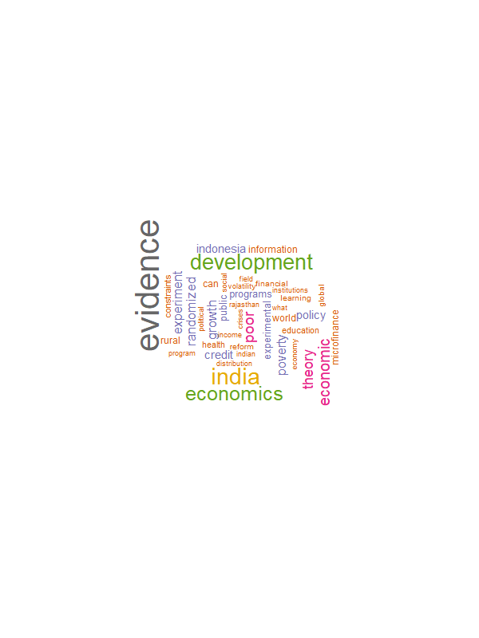
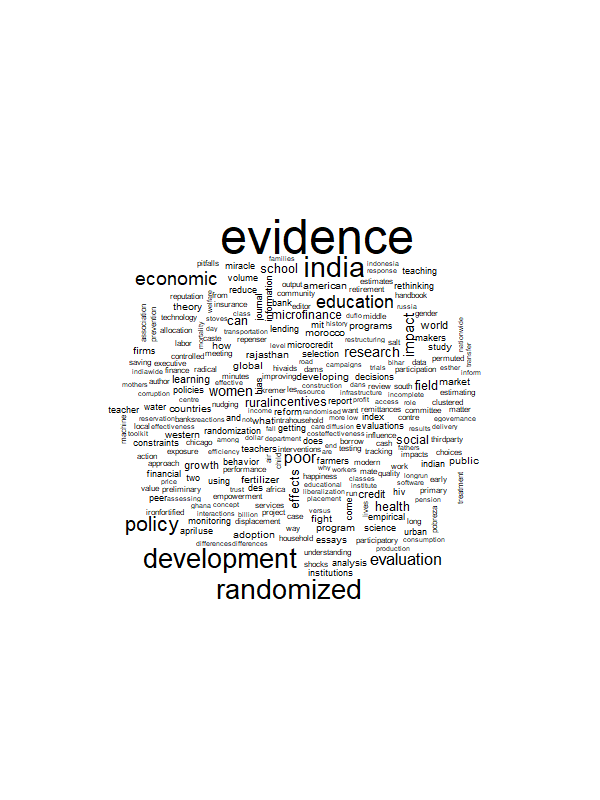

```{r setup, include=FALSE}
knitr::opts_chunk$set(echo = TRUE, error = TRUE)
```

```{r}
library("readr")
library("xml2")
library("stringr")
library("rvest")
library("NLP")
library("tm")
library("wordcloud")
library("dplyr")
library("ggplot2")
```


# Practice with regular expression
```{r}
# Import two csv files
data <- read.csv("../data/cleandata/scholarA.csv")
datb <- read.csv("../data/cleandata/scholaraB.csv")
```
## Etract information from clean data.
```{r}
# a) For the two scholars, how many of their paper titles begin with a word that starts with a vowel, respectively?
dat1 <- data$titlea
start1 <- str_detect(as.character(dat1),"^[AEIOUaeiou]")
sum(start1)
dat2 <- datb$titleb
start2 <- str_detect(as.character(dat2),"^[AEIOUaeiou]")
sum(start2)
# For cholar A and B, 118 papers start with vowels.

# b) For the two scholars, how many of their paper titles end with “s” respectively?
ending1 <- str_detect(as.character(dat1),"s$")
sum(ending1)
# 78 scholar papaer titles end with "s"
ending2 <- str_detect(as.character(dat2),"s$")
sum(ending2)
# 74 scholar papaer titles end with "s"

#c) For the two scholars, find the longest title, respectively (“longest” in terms of number of characters).
dat11 <- nchar(as.character(dat1))
dat1[which.max(dat11)]
dat22 <- nchar(as.character(dat2))
dat2[which.max(dat22)]

# d) For the two scholars, calculate the variable “number of punctuation symbols in the their titles”. Display summary() statistics of these variables, and the corresponding histograms.
# for scholar A
png("../images/number_of_punctuation_scholarA.png",width = 600,height = 800)
punct1 <- str_count(as.character(dat1),"[[:punct:]]")
sum1 <- summary(punct1)
hist(punct1,main = "Number of punctations of scholar A",xlab = "Number")
dev.off()
# for scholar B
png("../images/number_of_punctuation_scholarB.png",width = 600,height = 800)
punct2 <- str_count(as.character(dat2),"[[:punct:]]")
sum2 <- summary(punct2)
hist(punct2,main = "Number of punctations of scholar B",xlab = "Number")
dev.off

# e) Remove stop words(“the”, “a”, “an”, “and”, “in”, “if”, “but”), numbers and punctuations from the titles.
stopwords <- c("the","a","an", "and","in","if","but","The","A","An","And","In","If","But")
remove1 <- removeWords(as.character(dat1),stopwords) %>% removeNumbers() %>% removePunctuation() %>% stripWhitespace()
data.frame(remove1)
remove2 <- removeWords(as.character(dat2),stopwords) %>% removeNumbers() %>% removePunctuation() %>% stripWhitespace()
data.frame(remove2)

# f) Excluding stop words, numbers and punctuations, what are the 10 most frequent words in scholar A’s titles?
freq1 <- sort(table(unlist(strsplit(remove1, "[[:space:]]+"))), decreasing = TRUE)[1:10]
freq1

# g) Excluding stop words, numbers and punctuations, what are the 10 most frequent words in scholar B’s titles?
freq2 <- sort(table(unlist(strsplit(remove2, "[[:space:]]+"))), decreasing = TRUE)[1:10]
freq2

```

# Data Visualization
```{r}
# wordcloud for scholar A and B respectively.
png("../images/wordcloudA.png",width = 600,height = 800)
cloud1 <- wordcloud(word = remove1, min.freq = 10, max.words = 200, scale=c(3.5,0.25), rot.per=0.35,colors=brewer.pal(8, "Dark2"))
dev.off()

png("../images/wordcloudB.png",width = 600,height = 800)
cloud2 <- wordcloud(word = remove2)
dev.off()
```

```{r}
# Line plot that displays the number of the publications for the two scholars across years.
png("../images/number_of_punctuations.png")
dfa <- tbl_df(data) %>% group_by(yearsa) %>% summarize(suma = sum(citationa,na.rm = TRUE))
dfb <- tbl_df(datb) %>% group_by(yearsb) %>% summarize(sumb = sum(citationb,na.rm = TRUE))
ggplot() + 
  geom_line(data=dfa,aes(x=yearsa,y=suma,color="scholarA"),na.rm = TRUE) +
  geom_line(data=dfb,aes(x=yearsb,y=sumb,color="scholarB"),na.rm = TRUE) +
  theme_bw() +
  xlab("years") +
  ylab("Sum of publications")
dev.off()
```
## From the above graph, we can see that scholar B starts publishing later than A. However, scholar B publishes more then A in total, especially in year 2000s. 

# For each author, select 3 of the top 10 most frequently used words in his/her titles. With this set of five words, create a plot with timelines that show the trend

## Scholar A
```{r}
unique_yearA <- unique(data$yearsa)
count_A <- function(x) {
  x_countA <- rep(0,length(unique(data$yearsa)))
  for (i in 1:length(unique(data$yearsa))) {
    tmp <- filter(data,yearsa==unique_yearA[i])
    x_countA[i] <- sum(str_count(tmp$titlea,x),na.rm = TRUE) 
  }
  print(x_countA)
}
e_countA <- count_A("Evidence")
d_countA <- count_A("Development")
f_countA <- count_A("for")
countA <- data.frame(unique_yearA,e_countA,d_countA,f_countA)
png("../images/most_frequently_used_A.png",width = 600,height = 800)
ggplot(data = countA) +
  geom_line(aes(x=unique_yearA,y=e_countA,color="Evidence"),na.rm = TRUE) +
  geom_line(aes(x=unique_yearA,y=d_countA,color="Development"),na.rm = TRUE) + 
  geom_line(aes(x=unique_yearA,y=f_countA,color="for"),na.rm = TRUE)+
  theme_bw() +
  xlab("Years") +
  ylab("Usage times")
 dev.off()
```

 
## Scholar B
```{r}
unique_yearB <- unique(datb$yearsb)
count_B <- function(x) {
  x_countB <- rep(0,length(unique(datb$yearsb)))
  for (i in 1:length(unique(datb$yearsb))) {
    tmb <- filter(datb,yearsb==unique_yearB[i])
    x_countB[i] <- sum(str_count(tmb$titleb,x),na.rm = TRUE) 
  }
  print(x_countB)
}
f_countB <- count_B("for")
i_countB <- count_B("India")
r_countB <- count_B("randomized")
countB <- data.frame(unique_yearB,f_countB,i_countB,r_countB)
png("../images/most_frequently_used_B.png",width = 600,height = 800)
ggplot(data = countB) +
  geom_line(aes(x=unique_yearB,y=f_countB,color="for"),na.rm = TRUE) +
  geom_line(aes(x=unique_yearB,y=i_countB,color="India"),na.rm = TRUE) + 
  geom_line(aes(x=unique_yearB,y=r_countB,color="randomized"),na.rm = TRUE)+
  theme_bw() +
  xlab("Years") +
  ylab("Usage times")
dev.off()
```

# Report

## Report for this lab is basically doing analyze around two scholars. They are in the economic field and they share some in common. I am going to show their commons and differences.

### 1. Firstly, I am going to show co-authors and to see if they have published papers together.
```{r}
# On average, which scholar has more co-authors?
co_authorA <- unique(unlist(strsplit(as.character(data$authora),split = ",")))
length(co_authorA)-1
co_authorB <- unique(unlist(strsplit(as.character(datb$authorb),split = ",")))
length(co_authorB)-1
# scholar A has 577 co-authors and scholar B has 495 co-authors. Comapring these two scolars, we find that scholar A has more co-authors.

# Did the two scholars once publish a paper together? If yes, please print the related information of that paper.
publish_together <- data$titlea[as.character(data$authora)=="AV Banerjee, E Duflo"]
data.frame(publish_together)
# We can see that two scholars have published papers in common. 

# What’s the paper with the most co-authors?
data$titlea[which.max(nchar(as.character(data$authora)))]
datb$titleb[which.max(nchar(as.character(datb$authorb)))]
# Scholar A nad B has the same the paper with the most co-authors: A multifaceted program causes lasting progress for the very poor: Evidence from six countries. 
```

### 2. In this part, I am going to look more on their citations and years. I am going to analyze their citations information, including where they publish their paper, total numbers of citation for each journal, and then we can leanr that which journla is the most influencial in their academic field.
```{r}
# How many distinct journals are there in the two citation tables?
length(unique(data$journala))
length(unique(datb$journalb))
# There are 368 unique journals in the scholarA and 348 unique journals in the scholarB.

# Count the total number of citations for each journal.
tb1 <- tbl_df(data) %>% group_by(journala) %>% summarize(suma = sum(citationa,na.rm = TRUE))
tb1
tb2 <- tbl_df(datb) %>% group_by(journalb) %>% summarize(sumb = sum(citationb,na.rm = TRUE))
tb2

# From the citations data, which journal do you think is the most influencial in their academic field?
tb1$journala[which.max(tb1$suma)]
tb2$journalb[which.max(tb2$sumb)]

# Accoding too these reult, two sholars share the same journal: The Quarterly journal of economics. Both of the two journlas have the most citiations in this journal.So, this journal is the most influencial in their academic field. 

```

# Graph
## We have wordcloud graphs to how thir mostly used words in their paper titles. 
```{r}


```


