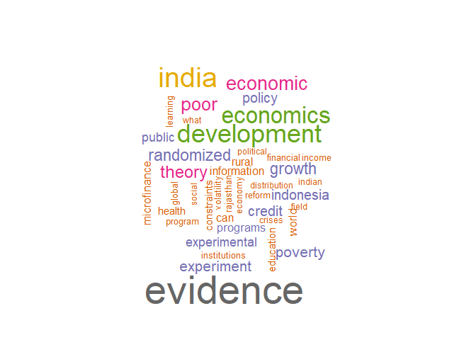
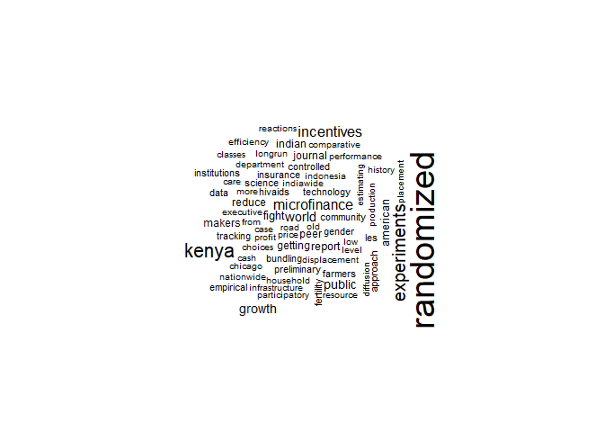
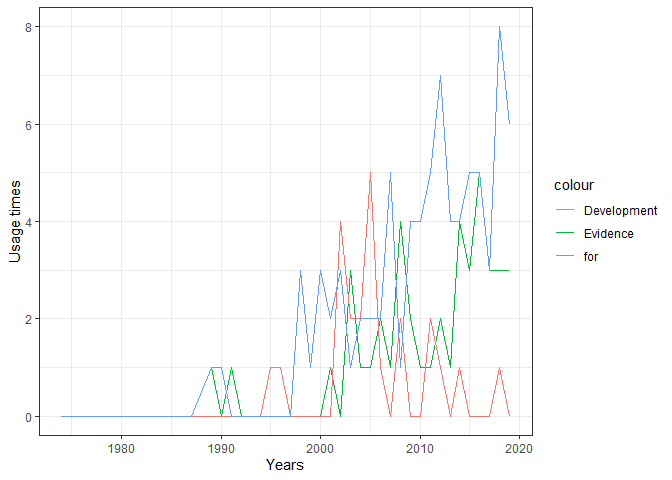
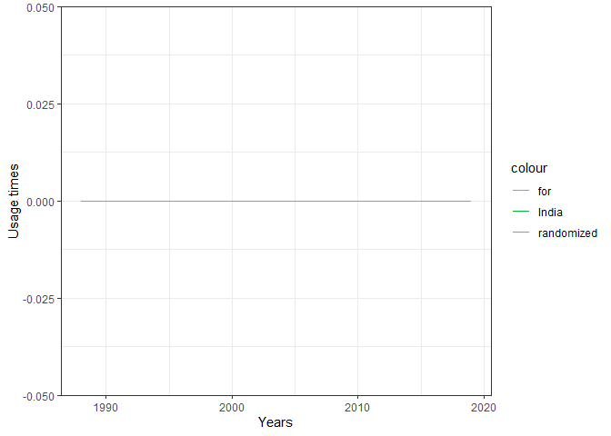
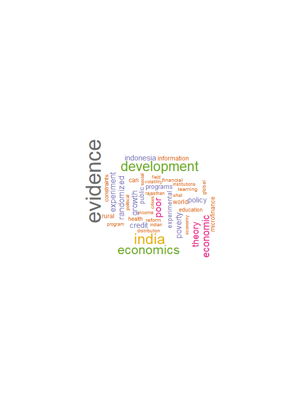
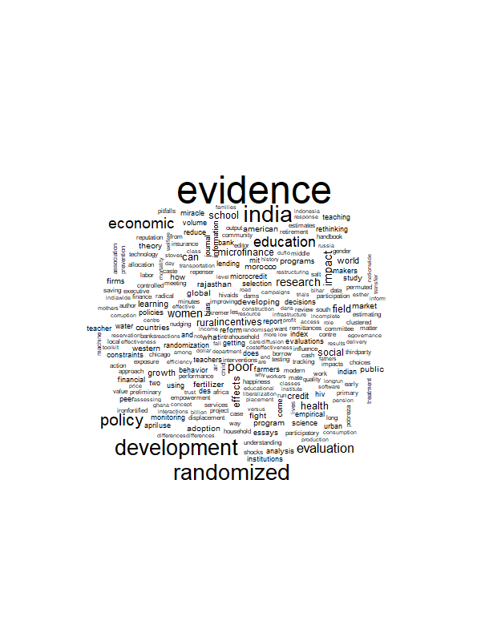

workout3-anqi-chen
================
Anqi Chen
12/2/2019

``` r
library("readr")
library("xml2")
library("stringr")
library("rvest")
```

    ## 
    ## Attaching package: 'rvest'

    ## The following object is masked from 'package:readr':
    ## 
    ##     guess_encoding

``` r
library("NLP")
library("tm")
library("wordcloud")
```

    ## Loading required package: RColorBrewer

``` r
library("dplyr")
```

    ## 
    ## Attaching package: 'dplyr'

    ## The following objects are masked from 'package:stats':
    ## 
    ##     filter, lag

    ## The following objects are masked from 'package:base':
    ## 
    ##     intersect, setdiff, setequal, union

``` r
library("ggplot2")
```

    ## 
    ## Attaching package: 'ggplot2'

    ## The following object is masked from 'package:NLP':
    ## 
    ##     annotate

# Practice with regular expression

``` r
# Import two csv files
data <- read.csv("../data/cleandata/scholarA.csv")
datb <- read.csv("../data/cleandata/scholaraB.csv")
```

## Etract information from clean data.

``` r
# a) For the two scholars, how many of their paper titles begin with a word that starts with a vowel, respectively?
dat1 <- data$titlea
start1 <- str_detect(as.character(dat1),"^[AEIOUaeiou]")
sum(start1)
```

    ## [1] 118

``` r
dat2 <- datb$titleb
start2 <- str_detect(as.character(dat2),"^[AEIOUaeiou]")
sum(start2)
```

    ## [1] 118

``` r
# For cholar A and B, 118 papers start with vowels.

# b) For the two scholars, how many of their paper titles end with “s” respectively?
ending1 <- str_detect(as.character(dat1),"s$")
sum(ending1)
```

    ## [1] 78

``` r
# 78 scholar papaer titles end with "s"
ending2 <- str_detect(as.character(dat2),"s$")
sum(ending2)
```

    ## [1] 74

``` r
# 74 scholar papaer titles end with "s"

#c) For the two scholars, find the longest title, respectively (“longest” in terms of number of characters).
dat11 <- nchar(as.character(dat1))
dat1[which.max(dat11)]
```

    ## [1] <U+958B><U+767A><U+7D4C><U+6E08><U+5B66> Development Economics <U+3044><U+307E><U+3082> <U+300C><U+98E2><U+9913><U+300D> <U+306B><U+82E6><U+3057><U+3080><U+591A><U+304F><U+306E><U+4EBA><U+305F><U+3061><U+3092><U+6551><U+3046><U+3053><U+3068><U+306F><U+3067><U+304D><U+308B><U+306E><U+3067><U+3057><U+3087><U+3046><U+304B>?(<U+300C><U+65B0><U+3057><U+3044><U+7D4C><U+6E08><U+5B66><U+300D> <U+3078><U+3088><U+3046><U+3053><U+305D>.)--(NEW ECONOMICS <U+65B0><U+3057><U+3044><U+7D4C><U+6E08><U+5B66>)
    ## 475 Levels: 'New Development Economics' and the challenge to theory ...

``` r
dat22 <- nchar(as.character(dat2))
dat2[which.max(dat22)]
```

    ## [1] <U+958B><U+767A><U+7D4C><U+6E08><U+5B66> Development Economics <U+3044><U+307E><U+3082> <U+300C><U+98E2><U+9913><U+300D> <U+306B><U+82E6><U+3057><U+3080><U+591A><U+304F><U+306E><U+4EBA><U+305F><U+3061><U+3092><U+6551><U+3046><U+3053><U+3068><U+306F><U+3067><U+304D><U+308B><U+306E><U+3067><U+3057><U+3087><U+3046><U+304B>?(<U+300C><U+65B0><U+3057><U+3044><U+7D4C><U+6E08><U+5B66><U+300D> <U+3078><U+3088><U+3046><U+3053><U+305D>.)--(NEW ECONOMICS <U+65B0><U+3057><U+3044><U+7D4C><U+6E08><U+5B66>)
    ## 461 Levels: (Dis) organization and Success in an Economics MOOC ...

``` r
# d) For the two scholars, calculate the variable “number of punctuation symbols in the their titles”. Display summary() statistics of these variables, and the corresponding histograms.
# for scholar A
png("../images/number_of_punctuation_scholarA.png",width = 600,height = 800)
punct1 <- str_count(as.character(dat1),"[[:punct:]]")
sum1 <- summary(punct1)
hist(punct1,main = "Number of punctations of scholar A",xlab = "Number")
dev.off()
```

    ## png 
    ##   2

``` r
# for scholar B
png("../images/number_of_punctuation_scholarB.png",width = 600,height = 800)
punct2 <- str_count(as.character(dat2),"[[:punct:]]")
sum2 <- summary(punct2)
hist(punct2,main = "Number of punctations of scholar B",xlab = "Number")
dev.off
```

    ## function (which = dev.cur()) 
    ## {
    ##     if (which == 1) 
    ##         stop("cannot shut down device 1 (the null device)")
    ##     .External(C_devoff, as.integer(which))
    ##     dev.cur()
    ## }
    ## <bytecode: 0x000000001396dc08>
    ## <environment: namespace:grDevices>

``` r
# e) Remove stop words(“the”, “a”, “an”, “and”, “in”, “if”, “but”), numbers and punctuations from the titles.
stopwords <- c("the","a","an", "and","in","if","but","The","A","An","And","In","If","But")
remove1 <- removeWords(as.character(dat1),stopwords) %>% removeNumbers() %>% removePunctuation()
data.frame(remove1)
```

    ##                                                                                                                                                               remove1
    ## 1                                                                                                                                       simple model of herd behavior
    ## 2                                                                                                                        Occupational choice   process of development
    ## 3                                                                                                  Poor economics  radical rethinking of  way to fight global poverty
    ## 4                                                                                                        miracle of microfinance Evidence from  randomized evaluation
    ## 5                                                                                                                                             economic lives of  poor
    ## 6                                                                                                                               Inequality  growth What can  data say
    ## 7                                                                                                 Remedying education Evidence from two randomized experiments  India
    ## 8                                                                           History institutions  economic performance  legacy of colonial land tenure systems  India
    ## 9                                                                                                                Growth theory through  lens of development economics
    ## 10                                                                                             Thy neighbors keeper  design of  credit cooperative with theory   test
    ## 11                                                                                                                                          diffusion of microfinance
    ## 12                                                                                                                                            theory of misgovernance
    ## 13                                                                                                           What is middle class about  middle classes around  world
    ## 14                                                                                                 Currency crises  monetary policy   economy with credit constraints
    ## 15                                                                            Do firms want to borrow more Testing credit constraints using  directed lending program
    ## 16                                                                                     Reputation effects   limits of contracting  study of  Indian software industry
    ## 17                                                                                                                Empowerment  efficiency Tenancy reform  West Bengal
    ## 18                                                                                           On  road Access to transportation infrastructure  economic growth  China
    ## 19                                                                                              Six randomized evaluations of microcredit Introduction  further steps
    ## 20                                                                                                                     experimental approach to development economics
    ## 21                                                                          Pitfalls of participatory programs Evidence from  randomized evaluation  education  India
    ## 22                                                                                                  Volatility  growth Credit constraints   composition of investment
    ## 23                                                                            multifaceted program causes lasting progress for  very poor Evidence from six countries
    ## 24                                                                                                         political economy of public goods Some evidence from India
    ## 25                                                                                                                                               Wordofmouth learning
    ## 26                                                                                                                                  Dualism  macroeconomic volatility
    ## 27                                                                                                                   simple model of monetary policy  currency crises
    ## 28                                                                                                              Financial development   instability of open economies
    ## 29                                                                                                                      Why has unemployment risen   New South Africa
    ## 30                                                                                                                 corporate balancesheet approach to currency crises
    ## 31                                                                                            Volatility  growth Credit constraints  productivityenhancing investment
    ## 32                                                                                                                                                 Addressing absence
    ## 33                                                                                                      shape of temptation Implications for  economic lives of  poor
    ## 34                                                                                                                        Riskbearing   theory of income distribution
    ## 35                                                                                                                History social divisions  public goods  rural India
    ## 36                         Improving immunisation coverage  rural India clustered randomised controlled evaluation of immunisation campaigns with  without incentives
    ## 37                                                                                                         Targeting  poor evidence from  field experiment  Indonesia
    ## 38                                                                                                                                               Top indian incomes –
    ## 39                                                                                      Do informed voters make better choices Experimental evidence from urban India
    ## 40                                                                                                                    Wealth health  health services  rural Rajasthan
    ## 41                                                                                   Ecolabeling for energy efficiency  sustainability  metaevaluation of US programs
    ## 42                                                                                                                                               economics of rumours
    ## 43                                                                                    Contracting Constraints Credit Markets  Economic Development Abhijit V Banerjee
    ## 44                                                                                                                                                    Making aid work
    ## 45                                                                               Putting  bandaid on  corpse incentives for nurses   Indian public health care system
    ## 46                                                                              How efficiently is capital allocated Evidence from  knitted garment industry  Tirupur
    ## 47                                                                     Microcredit under  microscope what have we learned   past two decades  what do we need to know
    ## 48                                                                                                                                                 Volatility  growth
    ## 49                                                                                                                                                         Corruption
    ## 50                                                                                            Inequality control rights  rent seeking sugar cooperatives  Maharashtra
    ## 51                                                                                                                    Capital markets   instability of open economies
    ## 52                                                                                                                                     Why does misallocation persist
    ## 53                                                                                                                                    Poverty incentives  development
    ## 54                                                                                 Longrun health impacts of income shocks Wine  phylloxera  nineteenthcentury France
    ## 55                                                                                                                 Marry for what Caste  mate selection  modern India
    ## 56                                                                                                                              Health care delivery  rural Rajasthan
    ## 57                                                                                                                             Information  dual economy  development
    ## 58                                                                                                       Parochial politics Ethnic preferences  politician corruption
    ## 59                                                                                              Being surveyed can change later behavior  related parameter estimates
    ## 60                                                                                                                                      Giving credit where it is due
    ## 61                                                                                                      global survey of hydrogen energy research development  policy
    ## 62                                                                                                            Gossip Identifying central individuals   social network
    ## 63                                                                                                                                 evaluation of World Bank research 
    ## 64                                                                                                                                            miracle of microfinance
    ## 65                                                                                                                                  Walrasian theory of money  barter
    ## 66                                                                                                                                              Understanding poverty
    ## 67                                                                                                 Labor market discrimination  Delhi Evidence from  field experiment
    ## 68                                                                                                                                                      two poverties
    ## 69                                                                                                                                              simple model of voice
    ## 70                                                                                                                             Limited attention  income distribution
    ## 71                                                                              Debunking  stereotype of  lazy welfare recipient Evidence from cash transfer programs
    ## 72                                                                                                                                     Public action for public goods
    ## 73                                                                                      Volatility  growth Financial development   cyclical composition of investment
    ## 74                                                                                                                                                     Poor economics
    ## 75                                                                                            On frequent flyer programs  other loyaltyinducing economic arrangements
    ## 76                                                                                                                                              Banking reform  India
    ## 77                                                                                     Network structure   aggregation of information Theory  evidence from Indonesia
    ## 78                                                     Poor Economics Barefoot Hedgefund Managers DIY Doctors   Surprising Truth about Life on Less Than  dollar  Day
    ## 79                                                                                                                          Evolutionary selection  rational behavior
    ## 80                                                                                       Does elite capture matter Local elites  targeted welfare programs  Indonesia
    ## 81                                                                                                                                 Land reforms prospects  strategies
    ## 82                                                                                                           Selftargeting Evidence from  field experiment  Indonesia
    ## 83                                                                                                                                              Bank financing  India
    ## 84                                                   Are poor voters indifferent to whether elected leaders are criminal or corrupt  vignette experiment  rural India
    ## 85                                                                                                                                               Repenser la pauvreté
    ## 86                                                                                                                            Eviction threats  investment incentives
    ## 87                                                               Bundling health insurance  microfinance  India There cannot be adverse selection  there is no demand
    ## 88                                                                                              Institute for Financial Management  Research Centre for Micro Finance
    ## 89                                                                                                                          Strategy for economic reform  West Bengal
    ## 90                                                                                                                    New Development Economics   challenge to theory
    ## 91                                                                                                                          Educational Policy   Economics of  Family
    ## 92                                                                              Caste community  collective action  political economy of public good provision  india
    ## 93                                                                                                              Empowerment  efficiency  economics of agrarian reform
    ## 94                                                                                 From proof of concept to scalable policies challenges  solutions with  application
    ## 95                                                                                                                                                    Making aid work
    ## 96                                                                                                                    Beyond nandigram industrialisation  West Bengal
    ## 97                                                                                                                                          mis allocation of capital
    ## 98                                                               Can institutions be reformed from within Evidence from  randomized experiment with  Rajasthan police
    ## 99                                                                                                                                    Inequality growth  trade policy
    ## 100                                                                              Do credit constraints limit entrepreneurship Heterogeneity   returns to microfinance
    ## 101                                                                                                                                      Do firms want to borrow more
    ## 102                                                                                                                Poor economics rethinking poverty   ways to end it
    ## 103                                                                                               life cycle model  household savings Micro evidence from urban china
    ## 104                                                                          Can voters be primed to choose better legislators Experimental evidence from rural India
    ## 105                                                                              Promoting school participation  rural Rajasthan Results from some prospective trials
    ## 106                                                                                                              Lapproche expérimentale en économie du développement
    ## 107                                                   Improving police performance  Rajasthan India Experimental evidence on incentives managerial autonomy  training
    ## 108                                            Can information campaigns spark local participation  improve outcomes  study of primary education  Uttar Pradesh India
    ## 109                                                                                                    Computerassisted learning Evidence from  randomized experiment
    ## 110                                                                            uses of economic theory against  purely positive interpretation of theoretical results
    ## 111                                                                                                   Financial liberalization  volatility  emerging market economies
    ## 112                                                                                                                             Prospects  strategies for land reform
    ## 113                                                                  Tangible information  citizen empowerment Identification cards  food subsidy programs  Indonesia
    ## 114                                                                                                                        Dis organization  Success   Economics MOOC
    ## 115                                                                                             Decision theoretic approaches to experiment design  external validity
    ## 116                                                                                                                                           economic lives of  poor
    ## 117                                                                             impact of training informal health care providers  India  randomized controlled trial
    ## 118                                                                                      Repensar la pobreza un giro radical en la lucha contra la desigualdad global
    ## 119                                                                                 Can information campaigns raise awareness  local participation  primary education
    ## 120                                                                                               Who is getting  public goods  India Some evidence  some speculation
    ## 121                                               Egovernance accountability  leakage  public programs Experimental evidence from  financial management reform  india
    ## 122                                                                                                     Mandated empowerment handing antipoverty policy back to  poor
    ## 123                                                                                   Ordeal mechanisms  targeting Theory  evidence from  field experiment  indonesia
    ## 124                                                                                            Peer group externalities  learning incentives  theory of nerd behavior
    ## 125                                                                                                                      More than  billion people are hungry   world
    ## 126                                                   Mainstreaming  effective intervention Evidence from randomized evaluations of “Teaching at  Right Level”  India
    ## 127                                                                                                                                Rural Industrialization  East Asia
    ## 128                                                   Expanding access  increasing student learning  postprimary education  developing countries  review of  evidence
    ## 129                                                                                                                                             World Bank of  future
    ## 130                                                                             Aggregate fertility  household savings  general equilibrium analysis using micro data
    ## 131                                                                                                                                               Repensar la pobreza
    ## 132                                                                                   Networks migration  investment Insiders  outsiders  Tirupurs production cluster
    ## 133                                                                                                 Under  Thumb of History Political institutions   Scope for Action
    ## 134                                                                                                                                            Inequality  investment
    ## 135                                                                                                                                                            James 
    ## 136                                                                                                           nature of credit constraints Evidence from  Indian bank
    ## 137                                                                        Using gossips to spread information Theory  evidence from two randomized controlled trials
    ## 138                                                                                                                paradox of Indian growth  comment on Kochhar et al
    ## 139                                                                                                      Notes toward  theory of industrialization   developing world
    ## 140                                                                                                                                   Aging  Death under  Dollar  Day
    ## 141                                                                                                                             Improving health care delivery  India
    ## 142                                    Can egovernance reduce capture of public programs Experimental evidence from  financial reform of India’s employment guarantee
    ## 143                                                                                                           Neutrally stable outcomes  cheaptalk coordination games
    ## 144                                                                                              long term impacts of  “Graduation” program Evidence from West Bengal
    ## 145                                                                                                   Climbing out of poverty long term decisions under income stress
    ## 146                                                                                                                Evolutionary selection with discriminating players
    ## 147                                                                          power of transparency Information identification cards  food subsidy programs  Indonesia
    ## 148                                                                                                                            Do informed voters make better choices
    ## 149                                                                                                           Making Aid Work How to fight global poverty effectively
    ## 150                                                                                                          Evolution  rationality some recent gametheoretic results
    ## 151                                                                                                                                              What do banks not do
    ## 152                                                                                             Movies margins  marketing Encouraging  adoption of ironfortified salt
    ## 153                                                        Channels from Globalization to Inequality Productivity World versus Factor World with Comments  Discussion
    ## 154                                                                                                                                     Policies for  betterfed world
    ## 155                                                                                Come play with me Experimental evidence of information diffusion about rival goods
    ## 156                                                                                 Improving  quality of education  India Evidence from three randomized experiments
    ## 157                                                                                                                                               Bank Finance  India
    ## 158                                                                                                                                           theory of experimenters
    ## 159                                                                                                                                     Handbook of Field Experiments
    ## 160                                                                                                    Default  punishment Incentives  lending behavior  Indian banks
    ## 161                                                                                                                                                                  
    ## 162                                                                                  Changes  social network structure  response to exposure to formal credit markets
    ## 163                                                                      When Less is More Experimental Evidence on Information Delivery during Indias Demonetization
    ## 164                                                                                                                                                Inequality  growth
    ## 165                                                                                                                             Naive learning with uninformed agents
    ## 166                                                                                                                      Do credit constraints limit entrepreneurship
    ## 167                                                                              Delhi’s slumdwellers Deprivation preferences  political engagement among  urban poor
    ## 168                                                                               Is decentralized iron fortification  feasible option to fight anemia among  poorest
    ## 169                                                                                  Can ironfortified salt control anemia Evidence from two experiments  rural Bihar
    ## 170                                                                                                                       Evasiveness   distribution of prime numbers
    ## 171                                                                                                                                     Handbook of Field Experiments
    ## 172                                                                                                                                           miracle of microfinance
    ## 173                                                                                                                                         Microcredit is not  enemy
    ## 174                                                                                                                                            Word of mouth learning
    ## 175                                                                                                                             Notes for credit growth  trade policy
    ## 176                                                                                  N Qian  On  Road Access to Transportation Infrastructure  Economic Growth  China
    ## 177                                                     efficient deployment of police resources theory  new evidence from  randomized drunk driving crackdown  India
    ## 178                                                                                                                             entertaining way to behavioral change
    ## 179                                                                influence of randomized controlled trials on development economics research  on development policy
    ## 180                                                                                                                   Symposium on Institutions  economic performance
    ## 181                                                                   Effect of High School Matriculation Awards Evidence from Randomized Trials” NBER Working paper 
    ## 182                                                                                                                         Educational Policy   Economics of  Family
    ## 183                                                                                                       entertaining way to behavioral change Fighting HIV with MTV
    ## 184                                                                             Contracting out  LastMile of Service Delivery Subsidized Food Distribution  Indonesia
    ## 185                                                                                                       Poor economics Plädoyer für ein neues Verständnis von Armut
    ## 186                                                                                                                                   Help microfinance don’t kill it
    ## 187                                                                                                                    Investment Efficiency   Distribution of Wealth
    ## 188                                                                                                                                             Understanding Poverty
    ## 189                                                                                                   imperial legacy colonial land tenure systems  independent India
    ## 190                                                                                              Teaching at  right level Evidence from randomized evaluations  India
    ## 191                                                                                                     Crime punishment  monitoring Deterring drunken driving  India
    ## 192                                                                                                                   Wealth health  health services  rural Rajasthan
    ## 193                                                                                                                   dualeconomy model of modernization  development
    ## 194                                                                                          Leconomia dei poveri capire la vera natura della povertà per combatterla
    ## 195                                                                                                                                       Why arent children learning
    ## 196                                                                Can voters be primed to choose better legislators Evidence from two field experiments  rural India
    ## 197                                                                                                                                            Nonmarket institutions
    ## 198                                                                       Progressive freezing of finite cluster  locally canted spin Co Zn FeO spinel ferrite system
    ## 199                                                                                                                                                      Esther Duflo
    ## 200                                                                                                                                                platter of choices
    ## 201                                                                                                   Targeting Efficiency How well can we identify  poorest of  poor
    ## 202                                                                             Are  monitors overmonitored Evidence from Corruption Vigilance  Lending  Indian Banks
    ## 203                                                                                                                                           Bank competition  India
    ## 204                                                                                       Empowerment  Efficiency Economic Analysis of  Tenancy Reform Program  India
    ## 205                                                                                                                                Migration Integration  Development
    ## 206                                                                                                                            Herd behavior   reward for originality
    ## 207                                                    How much do existing borrowers value Microfinance Evidence from  experiment on bundling Microcredit  insurance
    ## 208                                                                             Does microfinance foster business growth  importance of entrepreneurial heterogeneity
    ## 209                                                                                             Microfinance as commitment savings Evidence from  AP crisis aftermath
    ## 210                                                                                         Response to ‘ reexamination of Banerjee  Iyer’by Iversen PalmerJones  Sen
    ## 211                                                           Nutrition iron deficiency anemia   demand for ironfortified salt evidence from  experiment  rural Bihar
    ## 212                                                                             Poor Economics  Radical Rethinking of  Way to Fight Global Poverty Reprint edition ed
    ## 213                                                                                                                   Making police reform real  Rajasthan experiment
    ## 214                                                                                                                                                Volatility  growth
    ## 215                                                                                                                                               Remedying education
    ## 216                                                                                                 Poor Economics  radical thinking of  way to fight global poverty 
    ## 217                                                                                                                         Universal basic income   developing world
    ## 218                                                                                        Unpacking  MultiFaceted Program to Build Sustainable Income for  Very Poor
    ## 219                                                                      Untapped math skills of working children  India Evidence possible explanations  implications
    ## 220                                                                                                                        Wordofmouth communication  social learning
    ## 221                                                                                                                        Growth theory through  lens of development
    ## 222                                                                                                                                 Banking  markets   monetary model
    ## 223                                                                                                      Currency Crises  Monetary Policy   CreditConstrained Economy
    ## 224                                                                                                      Inequality  Growth What Can  Data Say NBER Working paper no 
    ## 225                                                                                                        Do Quantity Setting Oligopolists Play  Cournot Equilibrium
    ## 226                                                                                role of competition  effective outsourcing Subsidized food distribution  Indonesia
    ## 227                                                                                                                               Poverty  income distribution  India
    ## 228                                                                                                                  introduction to  “Handbook of Field Experiments”
    ## 229                                                                                                                         Tangible information  citizen empowerment
    ## 230                                                                                       Information is power Identification cards  food subsidy programs  Indonesia
    ## 231                                                                                                                                                     Arm  kansrijk
    ## 232                                                                                                                                Tensor structure on smooth motives
    ## 233                                                                                                                Marry for What Caste  Mate Selection  Modern India
    ## 234                                                                                                                    experimental approach to development economics
    ## 235                                                         Do firms want to borrow more Testing credit constraints using  directed lending program MIT working paper
    ## 236                                                                                       Are  Monitors OverMonitored Evidence from Corruption  Lending  Indian Banks
    ## 237                                                                                                                                           Globalization  all that
    ## 238                                                                                                      Remedying Education Evidence from Two Randomized Experiments
    ## 239                                                                  Do Firms Want to Borrow More Testing Credit Constraints Using  Directed Lending Program Banerjee
    ## 240                                                                           Do Firms Want to Borrow More Testing Credit Constraints Using  Directed Lending Program
    ## 241                                                                                               Capital flows output volatility  financial crises  emerging markets
    ## 242                                              Market Imperfections Communities   Organization of Production  Empirical Analysis of Tirupur’s GarmentExport Network
    ## 243                                                                                                        Information as  incentive Experimental evidence from delhi
    ## 244                                                                       Measured Profit is Not Welfare Evidence from  Experiment on Bundling Microcredit  Insurance
    ## 245                                                                                                            Radjasthan police performence  perception intervention
    ## 246                                                                                                                                                        Miracle of
    ## 247                                                                          Amyloid precursor protein neurotrophic properties as  target to cure Alzheimer’s disease
    ## 248                                                                                                                                 Handbook of Economic Growth Vol A
    ## 249                                                                   New Directions  Development Economics Theory or Empirics  Symposium  Economic  Political Weekly
    ## 250                                                                                                                                             Volatility RD  growth
    ## 251                                                                                                                                              Comments  Discussion
    ## 252                                                                                                                              Comment on  Paper by Stephan Haggard
    ## 253                                                                                          C Kinnan ‘ Miracle of Microfinance Evidence from  Randomized Evaluation’
    ## 254                                                                                                       Entertainment Education  Attitudes Toward Domestic Violence
    ## 255                                                                                          Private Outsourcing  Competition Subsidized Food Distribution  Indonesia
    ## 256                                               How important are matching frictions   labour market experimental  nonexperimental evidence from  large indian firm
    ## 257                                                                             Contracting Out  LastMile of Service Delivery Subsidized Food Distribution  Indonesia
    ## 258                                                                                    Network structure   aggregation of information Theory  evidence from Indonesia
    ## 259                                                                                                    Computerassisted learning Evidence from  randomized experiment
    ## 260                                                                                                                       not so simple economics of lending to  poor
    ## 261                                                                                                                                      why fighting poverty is hard
    ## 262                                                                                                                                   Aging  death under  dollar  day
    ## 263                                                                                                                                    Public Action for Public Goods
    ## 264                                                                                                                                    Environmental equity  Michigan
    ## 265                                                                                                                                                          Calcutta
    ## 266                                                                                                  ‘Health Care Delivery  Health Status  Udaipur District Rajasthan
    ## 267                     Reputation effects   limits of contracting  study of  Indiam software industry Department of Economics Massachussetts Institute of Technology
    ## 268                                                                                                                                           Empowerment  efficiency
    ## 269                                                                                                                                 Walrasian Theory of Money  Barter
    ## 270                                                                                                      Can Microfinance Unlock  Poverty Trap for Some Entrepreneurs
    ## 271                                         challenges of universal health insurance  developing countries Evidence from  largescale randomized experiment  Indonesia
    ## 272                                                                                                                                          Growing Cleavages  India
    ## 273                                                                  Lack of Distortionary Effects of ProxyMeans Tests Results from  Nationwide Experiment  Indonesia
    ## 274                                                                              private sector is much more likely to misuse Aadhar than  governmentAbhijit Banerjee
    ## 275                                                                                                                  On numerical equivalence for algebraic cobordism
    ## 276                                                                                                                  Debunking  stereotype of  lazy welfare recipient
    ## 277                                                                                                                                         American Economic Journal
    ## 278                                                                                                                FourierMukai transformation on algebraic cobordism
    ## 279                                                                                                           Risk of Asking Being Surveyed Can Affect Later Behavior
    ## 280                                                                                              Acsusceptibility study  rare earth substituted magnetite ferrofluids
    ## 281                                                                                                    Identifying  Poor Social Networks   Aggregation of Information
    ## 282                                                                                                                Marry for What Caste  Mate Selection  Modern India
    ## 283                                                  Pitfalls of Participatory Programs Evidence from  Randomized Evaluation  Education  India NBER Working Paper No 
    ## 284                                                                                                                  Pitfalls of Participatory Programs Evidence from
    ## 285                                                                                                                    experimental approach to development economics
    ## 286                                                                                                     UNIT ROOT AND COINTEGRATION TESTING GUEST EDITORSINTRODUCTION
    ## 287                                                                                                                                             Bank financing  India
    ## 288                                                                                                                                                  Social Securityr
    ## 289                                                                                                     Aassve Arnestein  Bruno Arpino“Dynamic MultiLevel Analysis of
    ## 290                                                                                                                                                   Andrew F Newman
    ## 291                                                                                            Peer group externalities  learning incentives  theory of nerd behavior
    ## 292                                                                                                                                   Essays on information economics
    ## 293                                                                       Public Information is  Incentive for Politicians Experimental Evidence from Delhi Elections
    ## 294                                                                                   Replication data for Targeting  Poor Evidence from  Field Experiment  Indonesia
    ## 295                                                                                         ‘Beating  Odds’ versus ‘Changing  Odds’ Poverty Resilience  Family Policy
    ## 296                                                                            How Do Norms Travel Theorizing International Women’s Rights  Transnational Perspective
    ## 297                                                                                                                                    Access to Credit  Productivity
    ## 298                                                                                                                                             Leave Room for Growth
    ## 299                                                                               Consumer perceptions of price quality  value  meansend model  synthesis of evidence
    ## 300                                                                                            Assessing Development Financial Institutions  Public Interest Analysis
    ## 301                                                                                                                                         Russia’s Phony Capitalism
    ## 302                                                                                     DP Unpacking  MultiFaceted Program to Build Sustainable Income for  Very Poor
    ## 303                                                                                                                 Ecolabeling for energy efficiency  Sustainability
    ## 304                                                                                            Deal with  Devil  Successes  Limitations of Bureaucratic Reform  India
    ## 305                                                                                                                                                     Philip Armour
    ## 306                                                                                                                                         Movies Margins  Marketing
    ## 307                                                                                                       Analysis  Forecast on  Potential of China’s Economic Growth
    ## 308                                                                          DP Contracting out  LastMile of Service Delivery Subsidized Food Distribution  Indonesia
    ## 309                                                                                                                                                   Featured author
    ## 310                                                                                                              Education Asymmetry Brain v Brawn  rural Communities
    ## 311                                            DP Egovernance Accountability  Leakage  Public Programs Experimental Evidence from  Financial Management Reform  India
    ## 312                                                                                                                                         Essays  political economy
    ## 313                                                                             DP From Proof of Concept to Scalable Policies Challenges  Solutions with  Application
    ## 314                                                                                                                                 Bagachwa M m  Bah T  Bailey M n n
    ## 315                                                  DP Mainstreaming  Effective Intervention Evidence from Randomized Evaluations of Teaching at  Right Level  India
    ## 316                                                                               DP Can IronFortified Salt Control Anemia Evidence from Two Experiments  Rural Bihar
    ## 317                                               Impacto de la política social y ambiental en el consumo ante eventos climáticos extremos de precipitación en México
    ## 318                                                                                                                              Long  Hidden History of  US  Somalia
    ## 319                                                                                                                             Reform  International Monetary System
    ## 320                                                                                                                     What Have We Learned from OLPC Pilots to Date
    ## 321                                                                                                                                          HiUECu nghèo thoát nghèo
    ## 322                                                                                                                                             MIT PLACEMENT OFFICER
    ## 323                                                                                                                                                   Featured author
    ## 324                                                                    DP Measured Profit is Not Welfare Evidence from  Experiment on Bundling Microcredit  Insurance
    ## 325                                                    Page numbers followed by  letter f or t refer to figures or tables respectively Adam S      Adams P   n  n   …
    ## 326                                                                                                        DP Gossip Identifying Central Individuals   Social Network
    ## 327                                                                                                                                                           August 
    ## 328                                                              Affidato M  Adelman S  affirmative action policies  South Africa  Africa labour market s comparisons
    ## 329                                                                                              DP Under  Thumb of History Political Institutions   Scope for Action
    ## 330                                                                                     Profit is Not Welfare Evidence from  Experiment on Bundling Credit  Insurance
    ## 331                                                                                    Beijer Institute of Ecological Economics v vii  n  Bell Clive  Bentham Jeremy 
    ## 332                                                                          DP Aggregate Fertility  Household Savings  General Equilibrium Analysis using Micro Data
    ## 333                                                                                                                                                   Targeting  poor
    ## 334                                                                                                                                                  EDITOR’S JOURNAL
    ## 335                                                                                                                                             MIT PLACEMENT OFFICER
    ## 336                                                                                                         Political Economy of Institutions  Development First Part
    ## 337                                                                                                                  Financial Capability   Poor Are We Missing  Mark
    ## 338                                                                                                      Caballero RJ   n  Campbell JY  n n  n   Canner G  Caplin  nl
    ## 339                                          HK Chao et aleds Mechanism  Causality  Biology  Economics History Philosophy  Theory of  Life Sciences  DOI © Springer …
    ## 340                                                                                                  DP  miracle of microfinance Evidence from  randomized evaluation
    ## 341                                                                                      Does Elite Capture Matter Local Elites  Targeted Welfare Programs  Indonesia
    ## 342                                                                                      Does Elite Capture Matter Local Elites  Targeted Welfare Programs  Indonesia
    ## 343                                                                                                                Blades D  Blanchard O  Bo Z  Bohl M  Bortolotti B 
    ## 344                                                                                                                              Center for International Development
    ## 345                                                                                                 Marriage  modern India does caste still matter for mate selection
    ## 346                                                                                       DP On  Road Access to Transportation Infrastructure  Economic Growth  China
    ## 347                                                                                                                                              DOCUMENTO DE TRABAJO
    ## 348                                                           DP Can Institutions Be Reformed from Within Evidence from  Randomized Experiment with  Rajasthan Police
    ## 349                                                                                                                      Les classes moyennes dans les pays émergents
    ## 350                                                                               Questce que la classe moyenne dans les pays du Sud Journal of Economic Perspectives
    ## 351                                                 Page numbers followed by  letter f or trefer to figures or tables respectively Aarts L n Adams PM    t  Adda J n 
    ## 352                                                                                                                                     DP  Diffusion of Microfinance
    ## 353                                                                                                                                                        Corruption
    ## 354                             UBUAUDCUEUB Development Economics UUEU UCUEUUD UBUEUUUAUFUEUEBAUFUUUUUUUFUUDUBUEUUUUUBUCUBUUUDCUEUBUD UUUUUDNEW ECONOMICS UBUUUDCUEUB
    ## 355                                                                                                          Tensor functor from Smooth Motives to motives over  base
    ## 356                                                                                                                                          End of Hunger with REPLY
    ## 357                                                                                                                                    Development that works March  
    ## 358                                                                                                                   Calis JCJ  Campbell JY  Case    n n Cattell RB 
    ## 359                                                                                                                                                          On  Road
    ## 360                                                                                                                                                    Aleya Banerjee
    ## 361                                                                                                                                              Dr Mira Sen Banerjee
    ## 362                                                                                                 DP  Shape of Temptation Implications for  Economic Lives of  Poor
    ## 363                                                                                                                                  DP Giving Credit Where it is Due
    ## 364                                                                                                             DP Marry for What Caste  Mate Selection  Modern India
    ## 365                                                                                                         BilanEssai experimental approach to development economics
    ## 366                                                                                                                DP  Experimental Approach to Development Economics
    ## 367                                                                               household surveys LSMS   n income growth rates propoor s  nonincome achievements by
    ## 368                                                                      DP Pitfalls of Participatory Programs Evidence from  Randomized Evaluation  Education  India
    ## 369                                                                                              Source of heavy metals  sediments of  Port Jackson estuary Australia
    ## 370                                                                                                                    Why has unemployment risen   New South Africa 
    ## 371                                                                                     Workers Remittances  Important  Stable Source of External Development Finance
    ## 372                                                                                                                              Book Review of Understanding Poverty
    ## 373                                                                                                                       Migration  development  Mexican communities
    ## 374                                                                                                                        por qué es tan difícil combatir la pobreza
    ## 375                                                                                                                How to Spend  Billion to Make  World  Better Place
    ## 376                                                                                                       DP What is Middle Class about  Middle Classes Around  World
    ## 377                                                                               Impact evaluation of Pratham’s “Learning to Read”  “Reading to Learn” interventions
    ## 378                                                                                                                                              Udaipur Health Study
    ## 379                                                                                                                                                          Balsakhi
    ## 380                                                                                                   DP Parochial Politics Ethnic Preferences  Politician Corruption
    ## 381                                                                                                                                 DP Public Action for Public Goods
    ## 382                                                                                          DP Long Run Impacts of Income Shocks Wine  Phylloxera  th Century France
    ## 383                                                                                                                          Is hungary ready for inflation targeting
    ## 384                                                                                Consumption  remittances  migrant households Toward  productive use of remittances
    ## 385                                                                                                            How to Spend USD  Billion to Make  World  Better Place
    ## 386                                                                                                                                             MIT Placement Officer
    ## 387                                                                Long run health impacts of income shocks wine  Phylloxera  th century France Abhijit Banerjeeet al
    ## 388                                                                                                                      Essays on coordination cooperation  learning
    ## 389                                                                                                                                       DP  Economic Lives of  Poor
    ## 390                                                                                                                              Center for International Development
    ## 391                                                                                   Urban soil contamination  Bangkok Heavy metal  aluminium partitioning  topsoils
    ## 392                                                                                               THE ECONOMIC LIVES OF THE POOR DEVELOPMENT ECONOMICS  PUBLIC POLICY
    ## 393                                                                                            DP Remedying Education Evidence from Two Randomized Experiments  India
    ## 394                                                                                                       Special Topics  Economics  Challenge of World Poverty Fall 
    ## 395                                                                                                                                                     taxman cometh
    ## 396                                 Comment on “ HalfCentury of Development” by Richard N Cooper  “ Evolution of Development Thinking Theory  Policy” by Gustav Ranis
    ## 397                                                                                                                        Foundations of Development Policy Syllabus
    ## 398                                                                        DP Do Firms Want to Borrow More Testing Credit Constraints Using  Directed Lending Program
    ## 399                                                                                                                                            DP Top Indian Incomes 
    ## 400                                                                                                                                                  Aghion Philippe 
    ## 401                                                                                                                         Foundations of Development Policy Spring 
    ## 402                                                                                                             Financial Development   Instability of Open Economies
    ## 403                                                                                                                                                  Contract Farming
    ## 404                                                                                                                                         EMS  Partyless Panchayats
    ## 405                                                                                                                    Political Economy of Institutions  Development
    ## 406                                                                                    Polynomials Satisfied by Square Matrices  Converse to  Cayley–Hamilton Theorem
    ## 407                                                                  UUUUBUUEUUUUUUUUUAUU UUFUUUEUA UFUE UUUUUUFUBUUDU Political Economy of Institutions  Development
    ## 408                                                                                                   Development Economics Microeconomic Issues  Policy Models Fall 
    ## 409                                                                                                                                       Development Economics Fall 
    ## 410                                                                                                   Poverty Incentives  Development American Economic Review   May 
    ## 411                                                                                                           DP  Corporate Balance Sheet Approach to Currency Crises
    ## 412                                                                                                         Magnetic properties of spinel system ZnzTizCoCrx zFe x zO
    ## 413                                                                                                                Corporate BalanceSheet Approach to Currency Crises
    ## 414                                                                                     Ecolabeling for Energy Efficiency  Sustainability  Evaluation for US Programs
    ## 415                                                                                                                                        Contributors  Commentators
    ## 416                                                                                                             Baseline Sustainability Data for  Lake Superior Basin
    ## 417                                                                                             DP Currency Crises  Monetary Policy   Economy with Credit Constraints
    ## 418                                                                                                Currency Crises  Monetary Policy   Economy with Credit Constraints
    ## 419                                                                                                  BHALLA AS AND LAPEYRE FREDERIC Poverty  Exclusion   Global World
    ## 420                                                                                                                                Clark JM  Cline WR   Cohen Daniel 
    ## 421                                                                                                                                              Thy Neighbors Keeper
    ## 422                                                                                                                     Poverty  Exclusion   Global World Book Review
    ## 423                                                                                                                                              Occupational Choice 
    ## 424                                                                                                                      Bohn Henning   n n   Bottazzi L n Boyd X nll
    ## 425                                                                                                                DP Capital Markets   Instability of Open Economies
    ## 426                                                                                                         Liquidity Crises  Emerging Markets Theory  Policy Comment
    ## 427                                                                                                   Financial Liberalization  Volatility  Emerging Market Economies
    ## 428                                                                   Acute  chronic hypokalemia impair calcium metabolism  energetic responses during hypoxic injury
    ## 429                                                                                                                           Evolution  Rationality Some Recent Game
    ## 430                                                                                                                      Canadian Journal of Physiology  Pharmacology
    ## 431                                                                                            Brown RL  Brunner Karl  Bruno Michael  Bryan Michael E  Bryant Ralph  
    ## 432      Dani Rodrik “ Past Present  Future of Economic Growth” Global Citizens Foundation Working Paper   Lant Pritchett “Divergence Big Time” Journal of Economic …
    ## 433                                                                                                                                                  p—Acknowledgment
    ## 434                                                                                                                                         International Development
    ## 435                                                                                                                                      DEPARTMENT OF ECONOMICS M  T
    ## 436                                                                                                                                         Walrasian Theory of Money
    ## 437                                                                                                                       Neutrally Stable Outcomes  Cheap Talk Games
    ## 438                      Response of soybean plants to some microelements treatments growth nodulation certain physiological aspects as well as yield  its components
    ## 439                                                                                                           Economic damages of Roudbar earthquake  Northern Iran  
    ## 440                                                                                                                             list of Working Papers on  last pages
    ## 441                                                                                                                                     Peer Group Effects  Education
    ## 442 Evolutionary selection  rational behavior earlier versions of this paper were presented at  MiniConference on Evolution Learning  Experimentation University of …
    ## 443                                                                                                                 Remittances  poverty nexus Evidence from Pakistan
    ## 444                                                                                        bepartment of Economics bepartment of Economics Fisher Hall Anders en Hall
    ## 445                                                                                                                             Andersen Hall Northwestern University
    ## 446      Voters be Primed to Choose Better Legislators Experimental Evidence from Rural India” October  mimeo Harvard Universiy    Selvan Kumar Rohini Pande  Felix …
    ## 447                                                                                                                                                Lawrence H Summers
    ## 448                                                                                                                                       Burman BK Roy   Burnell AC 
    ## 449                                                                                                                 Assessing Fiscal Sustainability  Theory  Practice
    ## 450                                                                                                         Theory of Experimenters Robustness Randomization  Balance
    ## 451                                                  My interests lie  algebraic geometry  algebraic Ktheory More specifically my research concerns  study of motives
    ## 452                                                           Do Gender Stereotypes Reduce Girls Achievements Evidence from  Natural Experiment Do Gender Stereotypes
    ## 453                                                                                                  Alleviating poverty with experimental research   Nobel laureates
    ## 454                                                       Repensar la pobreza un giro radical en la lucha contra la desigualdad globalAbhijit V Banerjee Esther Duflo
    ## 455                                                                                                                                 Dualism  Macroeconomic Volatility
    ## 456                                                                                                            Police Performance  Public Perception  Rajasthan India
    ## 457                            Adjaouté K Danthine J  Isakov D Portfolio Diversification  Europe  Huizinga H  Jonung LEds  Internationalisation of Asset Ownership  …
    ## 458                                                                                                Poor Economics  Radical Rethinking of  Way to Fight Global Poverty
    ## 459                                                                                                                                                   reviewer thanks
    ## 460                                                                                                       bondmarkets see also domestic bondmarkets global bondmarket
    ## 461     Climate Protection Through Hydrogen Energy  International Survey of Research Development  Policy Solomon BD Michigan Technological University USA Heiman MK …
    ## 462                                                                                                                                            ¿ Cuál es tu evidencia
    ## 463                                                                                                                                              Permuted Title Index
    ## 464                                                                                                                                              Permuted Title Index
    ## 465                                                                             Will Chinese household savings plummet with  end of  onechild policy Maybe maybe not…
    ## 466                                                                                                          Thy Neighbors Keeper  Design of Cooperative with Theory 
    ## 467                                                                                Response to AllParty Parliamentary Group on Microfinance Call for Written Evidence
    ## 468                                                                                                                                Journal of Economic Perspectives I
    ## 469                                                                                 Burgess Robin Camerer Colin F Campante Filipe Campbell John Y Carroll Christopher
    ## 470                                                                                                                                               Aux urnes précariat
    ## 471                                                                                                                       ArmeniaThird Social Investment Fund Project
    ## 472                                                                                               Economía de la pobreza repensando la lucha contra la pobreza global
    ## 473                                                                                        MoroccoPoverty  social impact analysis of  National Slum Upgrading Program
    ## 474                                                                                                                                        Index by Author to Volume 
    ## 475                                                                                                                                                            INSTIT
    ## 476                                                                                                         JPAL Datasets Research  Teaching Output of  MIT Community
    ## 477                                                                                                                                          Notice bibliographique L
    ## 478                                                   St LuciaPilot for Organization of Eastern Caribbean States OECS Skills Enhancement for Inclusive Growth Project
    ## 479                                                                                                    How to Target  Poor Evidence from  Field Experiment  Indonesia
    ## 480                                                                           MIT Dept of Economics Working Papers Series Research  Teaching Output of  MIT Community
    ## 481                                                                                                        Parry Ian WH Accountability von UngernStemberg Th Acquirer
    ## 482                                                                                                                                    THE WORLD BANK ECONOMIC REVIEW
    ## 483                                                                                                                                         American Economic Journal
    ## 484                                                                                                                                     What Works  Poverty Reduction
    ## 485                                                                                                                                                     Cars not land
    ## 486                                                                                                            BIG ANSWERS FOR BIG QUESTIONS THE PRESUMPTION OF MACRO
    ## 487                                                                                                              Improving Police Effectiveness  Rajasthan Experiment
    ## 488                                                                                                                                        Index by Author to Volume 
    ## 489                                                                                                                  Report of  Editor Journal of Economic Literature
    ## 490                                                                                        EcuadorAgricultural Competitiveness  Sustainable Rural Development Project
    ## 491                                                                                                                                             Economics  Population
    ## 492                                                                                                                                        Index by Author to Volume 
    ## 493                                                                                                                                    Daniel Berkowitz Gérard Roland
    ## 494                                                                                                                                         American Economic Journal
    ## 495                                                                                                                                        Index by Author to Volume

``` r
remove2 <- removeWords(as.character(dat2),stopwords) %>% removeNumbers() %>% removePunctuation()
data.frame(remove2)
```

    ##                                                                                                                                                                        remove2
    ## 1                                                                                                                    How much should we trust differencesdifferences estimates
    ## 2                                                                                                           Poor economics  radical rethinking of  way to fight global poverty
    ## 3                                                              Schooling  labor market consequences of school construction  Indonesia Evidence from  unusual policy experiment
    ## 4                                                                                                                 miracle of microfinance Evidence from  randomized evaluation
    ## 5                                                                                        Grandmothers  granddaughters oldage pensions  intrahousehold allocation  South Africa
    ## 6                                                                                                                                                      economic lives of  poor
    ## 7                                                                                                    Women as policy makers Evidence from  randomized policy experiment  India
    ## 8                                                                                                                                      Women empowerment  economic development
    ## 9                                                                                                                 Using randomization  development economics research  toolkit
    ## 10                                                                                                                                       Inequality  growth What can  data say
    ## 11                                                                    role of information  social interactions  retirement plan decisions Evidence from  randomized experiment
    ## 12                                                                                                         Remedying education Evidence from two randomized experiments  India
    ## 13                                                                                                                        Growth theory through  lens of development economics
    ## 14                                                                                                  Nudging farmers to use fertilizer Theory  experimental evidence from Kenya
    ## 15                                                                                                       Railroads of  Raj Estimating  impact of transportation infrastructure
    ## 16                                                                                                                                                   diffusion of microfinance
    ## 17                                                                            Peer effects teacher incentives   impact of tracking Evidence from  randomized evaluation  Kenya
    ## 18                                                                                                                                    Powerful women does exposure reduce bias
    ## 19                                                                                                                    What is middle class about  middle classes around  world
    ## 20                                                                                     Do firms want to borrow more Testing credit constraints using  directed lending program
    ## 21                                                                                     Participation  investment decisions   retirement plan  influence of colleagues’ choices
    ## 22                                                                        Intrahousehold resource allocation  Cote dIvoire Social norms separate accounts  consumption choices
    ## 23                                                                                              Reputation effects   limits of contracting  study of  Indian software industry
    ## 24                                                                            Female leadership raises aspirations  educational attainment for girls  policy experiment  India
    ## 25                                                                                                                          Incentives work Getting teachers to come to school
    ## 26                                                                                                    On  road Access to transportation infrastructure  economic growth  China
    ## 27                                                                                                                              experimental approach to development economics
    ## 28                                                                                                                                                                        Dams
    ## 29                                                                                           How high are rates of return to fertilizer Evidence from field experiments  Kenya
    ## 30                                                                                   Pitfalls of participatory programs Evidence from  randomized evaluation  education  India
    ## 31                                                                                     multifaceted program causes lasting progress for  very poor Evidence from six countries
    ## 32                                                                                                              Use of randomization   evaluation of development effectiveness
    ## 33                                                                                      Child health  household resources  South Africa evidence from  old age pension program
    ## 34                                                                           Do labor market policies have displacement effects Evidence from  clustered randomized experiment
    ## 35                                                                                impact of education on fertility  child mortality Do fathers really matter less than mothers
    ## 36                                                                                                                                                          Addressing absence
    ## 37                                                                                                                         Monitoring works Getting teachers to come to school
    ## 38                                                                               Saving incentives for low middleincome families Evidence from  field experiment with HR Block
    ## 39                                  Improving immunisation coverage  rural India clustered randomised controlled evaluation of immunisation campaigns with  without incentives
    ## 40                                                                                                                        Happiness on tap Piped water adoption  urban Morocco
    ## 41                                                                                                                             Wealth health  health services  rural Rajasthan
    ## 42                                                                     Estimating  impact of microcredit on those who take it up Evidence from  randomized experiment  Morocco
    ## 43                                                                                                             Education HIV  early fertility Experimental evidence from Kenya
    ## 44                                                                School governance teacher incentives  pupil–teacher ratios Experimental evidence from Kenyan primary schools
    ## 45                                                                                    Up  smoke  influence of household behavior on  longrun impact of improved cooking stoves
    ## 46                                                                                                                                         Field experiments on discrimination
    ## 47                                                                                                             Turning  shove into  nudge  labeled cash transfer for education
    ## 48                                                                                          Impact of microcredit  rural areas of Morocco Evidence from  Randomized Evaluation
    ## 49                                                                                        Putting  bandaid on  corpse incentives for nurses   Indian public health care system
    ## 50                                                                                           Education  HIVAIDS prevention evidence from  randomized evaluation  Western Kenya
    ## 51                                                                                                                     Marketization of household production   EU–US gap  work
    ## 52                                                                                          Longrun health impacts of income shocks Wine  phylloxera  nineteenthcentury France
    ## 53                                                                                                                          Marry for what Caste  mate selection  modern India
    ## 54                                                                                                                                       Health care delivery  rural Rajasthan
    ## 55                                                                                       Impact of reservation  Panchayati Raj Evidence from  nationwide randomised experiment
    ## 56                                                                                                        Doubledebiased machine learning for treatment  structural parameters
    ## 57                                                                                                       Being surveyed can change later behavior  related parameter estimates
    ## 58                                                                                                                                                              Poor  rational
    ## 59                                                                          Truthtelling by thirdparty auditors   response of polluting firms Experimental evidence from India
    ## 60                                                                                                                                               Giving credit where it is due
    ## 61                                                                                                                             Indoor air pollution health  economic wellbeing
    ## 62                                                                     medium run effects of educational expansion Evidence from  large school construction program  Indonesia
    ## 63                                                                                                                     Gossip Identifying central individuals   social network
    ## 64                                                                                                                                                      Scaling up  evaluation
    ## 65                                                                                                                                                     miracle of microfinance
    ## 66                                                                                                                                    Field experiments  development economics
    ## 67                                                                                                                                              Educational production  Europe
    ## 68                                                                                                                                                Gender equality  development
    ## 69                                            Comparative costeffectiveness analysis to inform policy  developing countries  general framework with applications for education
    ## 70                                                                                                                                                  Why political reservations
    ## 71                                                                                                                                                              Poor economics
    ## 72                                                                                                                                                     Le développement humain
    ## 73                                                                                                         Unappreciated service Performance perceptions  women leaders  India
    ## 74                                                                                                                                                       Banking reform  India
    ## 75                                                                                               Peer effects   impact of tracking Evidence from  randomized evaluation  Kenya
    ## 76                                                                                     Political reservation  substantive representation Evidence from Indian village councils
    ## 77                                                              Poor Economics Barefoot Hedgefund Managers DIY Doctors   Surprising Truth about Life on Less Than  dollar  Day
    ## 78                                                                            Peer effects pupilteacher ratios  teacher incentives Evidence from  randomized evaluation  Kenya
    ## 79                                                                                                                    Double machine learning for treatment  causal parameters
    ## 80                                                                                                                              Expérience science et lutte contre la pauvreté
    ## 81                                                                              Additional resources versus organizational changes  education Experimental evidence from Kenya
    ## 82                                                                      Understanding technology adoption Fertilizer  Western Kenya preliminary results from field experiments
    ## 83                                                                                                                                                       Bank financing  India
    ## 84                                                                                                                             Human values   design of  fight against poverty
    ## 85                                                                                                                                                        Repenser la pauvreté
    ## 86                                                                                                                                 Richard T Ely Lecture  Economist as Plumber
    ## 87                                                                                                Women as Policy Makers Evidence from  IndiaWide Randomized Policy Experiment
    ## 88                                                                        Bundling health insurance  microfinance  India There cannot be adverse selection  there is no demand
    ## 89                                                                                                       Institute for Financial Management  Research Centre for Micro Finance
    ## 90                                                                                                       Cooking stoves indoor air pollution  respiratory health  rural Orissa
    ## 91                                                                                          From proof of concept to scalable policies challenges  solutions with  application
    ## 92                                                                                                                                                   mis allocation of capital
    ## 93                                                                        Can institutions be reformed from within Evidence from  randomized experiment with  Rajasthan police
    ## 94                                                                      Implications of pension plan features information  social interactions for retirement saving decisions
    ## 95                                                                                        Do credit constraints limit entrepreneurship Heterogeneity   returns to microfinance
    ## 96                                                                                                                                                Do firms want to borrow more
    ## 97                                                                                                                          Poor economics rethinking poverty   ways to end it
    ## 98                                                         Toilets can work Short  medium run health impacts of addressing complementarities  externalities  water  sanitation
    ## 99                                                                                                   Women as policy makers Evidence from  randomized policy experiment  India
    ## 100                                                                                                                       Lapproche expérimentale en économie du développement
    ## 101                                                                                                                 Doubledebiasedneyman machine learning of treatment effects
    ## 102                                                            Improving police performance  Rajasthan India Experimental evidence on incentives managerial autonomy  training
    ## 103                                                     Can information campaigns spark local participation  improve outcomes  study of primary education  Uttar Pradesh India
    ## 104                                                                                                             Computerassisted learning Evidence from  randomized experiment
    ## 105                                                                                                                                 Dis organization  Success   Economics MOOC
    ## 106                             Factors affecting nonadherence among patients diagnosed with unipolar depression   psychiatric department of  tertiary hospital  Kolkata India
    ## 107                                                                                                                                                    economic lives of  poor
    ## 108                                                                                             Nondeterminism with referential transparency  functional programming languages
    ## 109                                                                                             value of regulatory discretion Estimates from environmental inspections  India
    ## 110                                                                                               Repensar la pobreza un giro radical en la lucha contra la desigualdad global
    ## 111                                                                                          Can information campaigns raise awareness  local participation  primary education
    ## 112                                                                                 Womens leadership  policy decisions Evidence from  nationwide randomized experiment  India
    ## 113                                                        Egovernance accountability  leakage  public programs Experimental evidence from  financial management reform  india
    ## 114                                                                                                              Mandated empowerment handing antipoverty policy back to  poor
    ## 115                                                                                                                               More than  billion people are hungry   world
    ## 116                                                            Mainstreaming  effective intervention Evidence from randomized evaluations of “Teaching at  Right Level”  India
    ## 117                                                                Savings incentives for low moderateincome families   United States why is  savers credit not more effective
    ## 118                                                                               Generic machine learning inference on heterogenous treatment effects  randomized experiments
    ## 119                                                                                                                                                        Repensar la pobreza
    ## 120                                                                                                          Under  Thumb of History Political institutions   Scope for Action
    ## 121                                                                                                                      Education  fertility Experimental evidence from Kenya
    ## 122                                                                                      Grandmothers  grandaughters  effects of old age pension on child health  south africa
    ## 123                                                                                                                    nature of credit constraints Evidence from  Indian bank
    ## 124                                                                                 Using gossips to spread information Theory  evidence from two randomized controlled trials
    ## 125                                                                                                                                            Aging  Death under  Dollar  Day
    ## 126                                                                                                                          Lutter contre la pauvreté Le développement humain
    ## 127                                                                                                                                      Improving health care delivery  India
    ## 128                                             Can egovernance reduce capture of public programs Experimental evidence from  financial reform of India’s employment guarantee
    ## 129                                                                                                       long term impacts of  “Graduation” program Evidence from West Bengal
    ## 130                                                                    Évaluer limpact des programmes daide au développement le rôle des évaluations par assignation aléatoire
    ## 131                                                                              Efficiency  rent seeking  local government Evidence from randomized policy experiments  India
    ## 132                                                                                      Industrial restructuring  Russia early reactions fo firms to  shock of liberalization
    ## 133                                                                                                                          Can tracking improve learning Evidence from Kenya
    ## 134                                                                                                                                                             price is wrong
    ## 135                                                                                                                                        Social experiments to fight poverty
    ## 136                                                                                                                                                       What do banks not do
    ## 137                                                                                                           Randomized evaluations of interventions  social service delivery
    ## 138                                                                                                      Movies margins  marketing Encouraging  adoption of ironfortified salt
    ## 139                                                                                   Up  smoke  influence of household behavior on  longrun impact of improved cooking stoves
    ## 140                                                                                                 Monitoring Works Getting Teachers to Come to School NBER Working Paper No 
    ## 141                                                                       Cognitive science   field  preschool intervention durably enhances intuitive  not formal mathematics
    ## 142                                                                                                                   Women politicians gender bias  policymaking  rural India
    ## 143                                                                                         Come play with me Experimental evidence of information diffusion about rival goods
    ## 144                                                                                                                               Politics as  male domain  empowerment  India
    ## 145                                                                                           Evaluating  impact of development aid programmes  role of randomised evaluations
    ## 146                                                                                                  What does reputation buy differentiation   market for thirdparty auditors
    ## 147                                                                                                                                                        Bank Finance  India
    ## 148                                                                                           Implications of information  social interactions for retirement saving decisions
    ## 149                                                                                                                                          Handbook of development economics
    ## 150                                                                       Intrahousehold resource allocation  Cote DIvoire Social norms separate accounts  consumption choices
    ## 151                                                                                                                                              Handbook of Field Experiments
    ## 152                                                                                                             Default  punishment Incentives  lending behavior  Indian banks
    ## 153                                                                                           Changes  social network structure  response to exposure to formal credit markets
    ## 154                                                                                                                        Balancing growth with equity  view from Development
    ## 155                                                                                                                       Peer effects teacher incentives   impact of tracking
    ## 156                                                                                                                                                         Inequality  growth
    ## 157                                                                                                                        Entry exit  candidate selection Evidence from India
    ## 158                                                                                        Is decentralized iron fortification  feasible option to fight anemia among  poorest
    ## 159                                                                                           Can ironfortified salt control anemia Evidence from two experiments  rural Bihar
    ## 160                                                                                                                                            Microcrédit miracle ou désastre
    ## 161                                                                                                                                              Handbook of Field Experiments
    ## 162                                                                                                                                                    miracle of microfinance
    ## 163                                                                                       Community involvement  public goods provision Evidence from  field experiment  Ghana
    ## 164                                                                                                                                                  Microcredit is not  enemy
    ## 165                                                                                                   M Kremer “Using Randomization  Development Economics Research  Tool Kit”
    ## 166                                                              efficient deployment of police resources theory  new evidence from  randomized drunk driving crackdown  India
    ## 167                                                                         influence of randomized controlled trials on development economics research  on development policy
    ## 168                                                                                                                Understanding Technology Adoption Fertilizer  Western Kenya
    ## 169             Use of Randomization   Evaluation of Development Effectiveness Paper Prepared for  World Bank Operations Evaluation Department OED Conference on Evaluation  …
    ## 170                                                                                                                Poor economics Plädoyer für ein neues Verständnis von Armut
    ## 171                                                                                                                               Improving access to urban services for  poor
    ## 172                                                                                                       Comparative costeffectiveness to inform policy  developing countries
    ## 173                                                                                                                                            Help microfinance don’t kill it
    ## 174                                          value of discretion   enforcement of regulation Experimental evidence  structural estimates from environmental inspections  india
    ## 175                                                                                                       Teaching at  right level Evidence from randomized evaluations  India
    ## 176                                                                                                              Crime punishment  monitoring Deterring drunken driving  India
    ## 177                                                                                                                            Wealth health  health services  rural Rajasthan
    ## 178                                                                                                                                                               R  Kremer M“
    ## 179                                                                                      Truthtelling by thirdparty auditors Evidence from  randomized field experiment  India
    ## 180                                                                                                   Leconomia dei poveri capire la vera natura della povertà per combatterla
    ## 181                                                                                                                                                Why arent children learning
    ## 182                                                                                                                                  Nudging Farmers to Use Fertilizer Theory 
    ## 183                                                                                                                Towards  emissions trading scheme for air pollutants  india
    ## 184                                                                           Using randomization  development economics research  toolkit Centre for Economic Policy Research
    ## 185                                                                                                                                                                       Dams
    ## 186                                                              Effets du dispositif daccompagnement à la création dentreprise CréaJeunes Résultats dune expérience contrôlée
    ## 187                                                                                             Nudging Farmers to Utilize Fertilizer Theory  Experimental Evidence from Kenya
    ## 188                                                                                                            Targeting Efficiency How well can we identify  poorest of  poor
    ## 189                                                                                      Are  monitors overmonitored Evidence from Corruption Vigilance  Lending  Indian Banks
    ## 190                                                                                                                                                    Bank competition  India
    ## 191                                                                                                                                                      Banking Reform  India
    ## 192                                                                                                                 How Much Should We Trust DifferencesDifferences Estimation
    ## 193                                                             How much do existing borrowers value Microfinance Evidence from  experiment on bundling Microcredit  insurance
    ## 194                                                                                      Does microfinance foster business growth  importance of entrepreneurial heterogeneity
    ## 195                                                                    Nutrition iron deficiency anemia   demand for ironfortified salt evidence from  experiment  rural Bihar
    ## 196                                                                               Do labor market policies have displacement effect Evidence from  clustered random experiment
    ## 197                                                                                                                            Making police reform real  Rajasthan experiment
    ## 198                                                                                                                                          Handbook of development economics
    ## 199                                                                                                                           Use of randomization   evaluation of development
    ## 200                                           Education  HIVAIDS Prevention Evidence from  Randomized Evaluation  Western Kenya Background Paper to   World Development Report
    ## 201                              R  Tulloch C Comparative CostEffectiveness Analysis to Inform Policy  Developing Countries  General Framework with Applications for Education
    ## 202                                                      i Kremer M School governance teacher incentives  pupilteacher ratio experimental evidence from Kenyan primary schools
    ## 203                                                                                                                                    Poor Choices Poverty from  Ground Level
    ## 204                                                                                                  Towards  emissions trading scheme for air pollutants  India  Concept Note
    ## 205                                                                                                                                 Growth theory through  lens of development
    ## 206                                                                                                                        Monitoring works getting teachers to come to school
    ## 207                                                                             Efficiency  rent seeking  local governments Evidence from randomized policy experiments  India
    ## 208                                                                                                                                                                    Kremer 
    ## 209                                                                                                                           introduction to  “Handbook of Field Experiments”
    ## 210                                                                                    Randomized controlled trials development economics  policy making  developing countries
    ## 211                                                                                                Priced Out Aggregate Income Shocks  School Pricing   Chilean Voucher Market
    ## 212                                                                                Unpacking  Effects of Conditional Cash Transfer Programs Experimental Evidence from Morocco
    ## 213                                                                                                                                                              Arm  kansrijk
    ## 214                                                                                                                         Marry for What Caste  Mate Selection  Modern India
    ## 215                                                                                                                             experimental approach to development economics
    ## 216                                                                  Do firms want to borrow more Testing credit constraints using  directed lending program MIT working paper
    ## 217                                                                                                Are  Monitors OverMonitored Evidence from Corruption  Lending  Indian Banks
    ## 218                                                                                                               Remedying Education Evidence from Two Randomized Experiments
    ## 219                                                                                    Do Firms Want to Borrow More Testing Credit Constraints Using  Directed Lending Program
    ## 220                                                                               Impact of Education on Fertility  Child Mortality Do Fathers Really Matter Less than Mothers
    ## 221                                                                                                                     Case study of corruption canal irrigation  South India
    ## 222                                                                                                                                                         Poverty Action Lab
    ## 223                                                                                Measured Profit is Not Welfare Evidence from  Experiment on Bundling Microcredit  Insurance
    ## 224                                                                                                                                         Pensions taxes   budgetary process
    ## 225                                                                                                                                                 Paternalism versus Freedom
    ## 226                                                                                                                     Radjasthan police performence  perception intervention
    ## 227                                                                                                                                                                 Miracle of
    ## 228                                                                                                             How to Spend  Billion to Make  World  Better Place Book Review
    ## 229                                                                                   Amyloid precursor protein neurotrophic properties as  target to cure Alzheimer’s disease
    ## 230                                             Education  HIVAIDS Prevention Evidence from  randomized evaluation  Western Kenya” World Bank Policy Research Working Paper No
    ## 231                                                                                                   Holding Teachers Accountable Evidence from  Randomized Evaluation  India
    ## 232                                                                                                              Decentralization  political reservations  India Some evidence
    ## 233                                                                                                                          Intrahousehold Resource Allocation  Côte d’Ivoire
    ## 234                                                                                                                                                     Women as Policy Makers
    ## 235                                                                                                 Reflection Without Rules Economic Methodology  Contemporary Science Theory
    ## 236                                                                                                   C Kinnan ‘ Miracle of Microfinance Evidence from  Randomized Evaluation’
    ## 237                                                                                                                                                             Pourquoi Payer
    ## 238                                                                                                                                      Lack of Hope   Persistence of Poverty
    ## 239                                                                                                                                not so simple economics of lending to  poor
    ## 240                                                                                                             Computerassisted learning Evidence from  randomized experiment
    ## 241                                                                                                                                                             Poor Economics
    ## 242                                                                                                                                                      Reevaluating learning
    ## 243                                                                                                                                Experiments Science   Fight Against Poverty
    ## 244                                                                                                                                   Powerful Women Does Exposure Reduce Bias
    ## 245                                                                                                                                     Impact of Reservation   Panchayati Raj
    ## 246                                                                                                                                            Aging  death under  dollar  day
    ## 247                                                                                                           Chapterusingrandomizationindevelopmenteconomicsresearch Atoolkit
    ## 248                                                                                                                  How Much Should We Trust DifferencesDifferences Estimates
    ## 249                                                                                                                                                                   Calcutta
    ## 250                                                                                               Women as Policy Makers Evidence from  IndiaWide Randomized Policy Experiment
    ## 251                                                                                                                                                           Public Economics
    ## 252                              Reputation effects   limits of contracting  study of  Indiam software industry Department of Economics Massachussetts Institute of Technology
    ## 253                                                                                                                                    Essays  empirical development economics
    ## 254                                                                                      Industrial Restructuring  Russia Early Reactions of Firms to  Shock of Liberalization
    ## 255                                                                                                                                                           Abhijit Banerjee
    ## 256                                                                                                                                                  Supplementary Material to
    ## 257                                                                        P  Kremer M Peer Effects Class Size  Teacher Incentives Evidence from  Randomized Evaluation  Kenya
    ## 258                                                                                                               Can Microfinance Unlock  Poverty Trap for Some Entrepreneurs
    ## 259                                                                                                               Report of  Search Committee to Appoint  Data Editor for  AEA
    ## 260                                                                                                                                 Report of  Editor American Economic Review
    ## 261                                                                                                                                                  American Economic Journal
    ## 262                                                                                                                 Deworming  informed debate requires  careful look at  data
    ## 263                                                                                                                                                               Esther Duflo
    ## 264                                                                        La régulation sociale des risques de catastrophe Ethnographie des quartiers périphériques de La Paz
    ## 265                                                                                                                                   Empirical essays on firm behavior  India
    ## 266                                                                                                                                     Anthropological Way of Doing Economics
    ## 267                                                                                                         Poor Economics  Radical Rethinking of  Way to Fight Global Poverty
    ## 268                                                                                                                                  Research Agenda for Development Economics
    ## 269                                                                                                                                       Repenser la lutte contre la pauvreté
    ## 270                                                                                                                 Poor Economics  Radical Rethinking of  Way to Fight Global
    ## 271                                                                                                                    Risk of Asking Being Surveyed Can Affect Later Behavior
    ## 272                                                                                                                Women as policy makers Evidence from  randomized experiment
    ## 273                                                                                  Pitfalls of Participatory Programs Evidence from  randomized evaluation  education  India
    ## 274                                                                                                                         Marry for What Caste  Mate Selection  Modern India
    ## 275                                                                                                                           Chaire Savoirs contre pauvreté Année académique 
    ## 276                                                                                                                           Pitfalls of Participatory Programs Evidence from
    ## 277                                                                                                                             experimental approach to development economics
    ## 278                                        Pauvreté accès au crédit et déterminants de la participation à un nouveau programme de micro crédit dans les zones rurales du Maroc
    ## 279                                             Understanding Technology Adoption Fertilizer  Western Kenya Evidence from Field Experiments PRELIMINARY AND INCOMPLETE April  
    ## 280                                                                                                                                                      Bank financing  India
    ## 281                                                                                                                                              American Economic Association
    ## 282                 Impact of Education On Fertility  Child Mortality Do Fathers Really Matter Less than Mothers OECD Development Centre Working Paper No  Formerly Webdoc No 
    ## 283                                                                                                                      Bureau for Research  Economic Analysis of Development
    ## 284                                                                        Does more Education for  Young increase  Wages of  Old Evidence from School Construction  Indonesia
    ## 285                                                                             Replication data for What Does Reputation Buy Differentiation   Market for ThirdParty Auditors
    ## 286                                                                                                    Replication data for Incentives Work Getting Teachers to Come to School
    ## 287                                                                                                                        Social  Emotional Learning Programs for Adolescents
    ## 288                                                                                                  ‘Beating  Odds’ versus ‘Changing  Odds’ Poverty Resilience  Family Policy
    ## 289                                                                                                                                 Report of  Editor American Economic Review
    ## 290                                    HIV prevention among youth  randomized controlled trial of voluntary counseling  testing for HIV  male condom distribution  rural Kenya
    ## 291                                                                                        Consumer perceptions of price quality  value  meansend model  synthesis of evidence
    ## 292                                                                                                               Misperceptions about immigration  support for redistribution
    ## 293                                                                                                                               World Development Indicators Online Database
    ## 294                                                                                                     Assessing Development Financial Institutions  Public Interest Analysis
    ## 295         This article has been accepted for publication  undergone full peer review  has not been through  copyediting typesetting pagination  proofreading process which …
    ## 296  NAITRE study on  impact of conditional cash transfer on poor pregnancy outcomes  underprivileged women protocol for  nationwide pragmatic clusterrandomised superiority …
    ## 297                                                                                                     Deal with  Devil  Successes  Limitations of Bureaucratic Reform  India
    ## 298                                                                                                                                                  Movies Margins  Marketing
    ## 299                                                                                                                Analysis  Forecast on  Potential of China’s Economic Growth
    ## 300                                                                                                                                                   DP  Economist as Plumber
    ## 301                                                                                                                       Education Asymmetry Brain v Brawn  rural Communities
    ## 302                                                     DP Egovernance Accountability  Leakage  Public Programs Experimental Evidence from  Financial Management Reform  India
    ## 303                                                                                      DP From Proof of Concept to Scalable Policies Challenges  Solutions with  Application
    ## 304                                                                                                                                                        Online Appendix for
    ## 305                                                                                                                                       Global Value Chains   Changing World
    ## 306                                                           DP Mainstreaming  Effective Intervention Evidence from Randomized Evaluations of Teaching at  Right Level  India
    ## 307                                                                                                             Minutes of  Meeting of  Executive Committee Chicago IL April  
    ## 308                                                                                        DP Can IronFortified Salt Control Anemia Evidence from Two Experiments  Rural Bihar
    ## 309                                                                                                                                     DP Field Experiments on Discrimination
    ## 310                                                        Impacto de la política social y ambiental en el consumo ante eventos climáticos extremos de precipitación en México
    ## 311                                                                                                                                       Long  Hidden History of  US  Somalia
    ## 312                                                                                                                                      Reform  International Monetary System
    ## 313                                                                           Urban agriculture poverty  food security Empirical evidence from  sample of developing countries
    ## 314                                                                                                             Minutes of  Meeting of  Executive Committee Chicago IL April  
    ## 315                                                                                                                                        Maryland Population Research Center
    ## 316                                                                                                                                                               Bibliography
    ## 317                                                                                                                                                wide angle view of learning
    ## 318                                                                                                                                                   HiUECu nghèo thoát nghèo
    ## 319                                                                                                                                                      MIT PLACEMENT OFFICER
    ## 320                                                                                                         DP Education HIV  Early Fertility Experimental Evidence from Kenya
    ## 321                                                                             DP Measured Profit is Not Welfare Evidence from  Experiment on Bundling Microcredit  Insurance
    ## 322                                                                                                                                           DP Perceiving Prospects Properly
    ## 323                                                                                                                                                                    August 
    ## 324                                                                                                                 DP Gossip Identifying Central Individuals   Social Network
    ## 325                                                                                                                       Happiness on tap piped water adoption  urban Morocco
    ## 326                                                                                                       DP Under  Thumb of History Political Institutions   Scope for Action
    ## 327                                                                                              Profit is Not Welfare Evidence from  Experiment on Bundling Credit  Insurance
    ## 328                                                                 DP Estimating  impact of microcredit on those who take it up Evidence from  randomized experiment  Morocco
    ## 329                                                                                                             Minutes of  Meeting of  Executive Committee Chicago IL April  
    ## 330                                                                                                                                                           EDITOR’S JOURNAL
    ## 331                                                                                                                                                      MIT PLACEMENT OFFICER
    ## 332                                                                                                                           Financial Capability   Poor Are We Missing  Mark
    ## 333                                                                                                                                                   Volume  November  Issue 
    ## 334                                                                         TURNING  SHOVE INTO  NUDGE  “LABELED CASH TRANSFER” FOR EDUCATION Najy Benhassine Florencia Devoto
    ## 335                                                                                                              Report of  Editor American Economic Journal Applied Economics
    ## 336                                                                                                             Minutes of  Meeting of  Executive Committee Chicago IL April  
    ## 337                                                                                                                         Poor Economics Rethinking Poverty   Ways to End it
    ## 338                                                                                                           DP  miracle of microfinance Evidence from  randomized evaluation
    ## 339                                                                                                                     Michael Greenstone Rohini Pande Nicholas Ryan October 
    ## 340                                                             DO LABOR MARKET POLICIES HAVE DISPLACEMENT EFFECTS EVIDENCE FROM  CLUSTERED RANDOMIZED EXPERIMENT Bruno Crepon
    ## 341                                                            Impacts of SchoolBased HIV Education on Reported Behavior  Knowledge of Adolescent Girls Evidence from Cameroon
    ## 342                                                                       DP Do Labor Market Policies Have Displacement Effects Evidence from  Clustered Randomized Experiment
    ## 343                                                                                                          Marriage  modern India does caste still matter for mate selection
    ## 344                                                                                                                                                                       WEAC
    ## 345                                                                                                                                                       REPENSER LA PAUVRETÉ
    ## 346                                                                                                                                                       Repenser la pauvreté
    ## 347                       Education  HIVAIDS  western Kenya results from  randomized trial assessing  longterm biological  behavioural impact of two schoolbased interventions
    ## 348                                                                                                              Report of  Editor American Economic Journal Applied Economics
    ## 349                                                                                                                                              American Economic Association
    ## 350                                                                                                                                                       Repenser la pauvreté
    ## 351                                                                                                                            Estimating  Benefit to Secondary School  Africa
    ## 352                                                                                                DP On  Road Access to Transportation Infrastructure  Economic Growth  China
    ## 353                                                                                                                                                       DOCUMENTO DE TRABAJO
    ## 354                                                                    DP Can Institutions Be Reformed from Within Evidence from  Randomized Experiment with  Rajasthan Police
    ## 355                                                                                                                                              Field Actions Science Reports
    ## 356                                                                                                                               Les classes moyennes dans les pays émergents
    ## 357                                                                                        Questce que la classe moyenne dans les pays du Sud Journal of Economic Perspectives
    ## 358                                                                                                                                DP Womens Empowerment  Economic Development
    ## 359                                                                                                                                              DP  Diffusion of Microfinance
    ## 360                                                                                                           Evolution of Economic Science Macroeconomics Growth  Development
    ## 361                                      UBUAUDCUEUB Development Economics UUEU UCUEUUD UBUEUUUAUFUEUEBAUFUUUUUUUFUUDUBUEUUUUUBUCUBUUUDCUEUBUD UUUUUDNEW ECONOMICS UBUUUDCUEUB
    ## 362                                                                                                                                                   End of Hunger with REPLY
    ## 363                                                                                             Big Question Paths Out of  Wilderness How to Sustain  Global Economic Recovery
    ## 364                                                                                                                    DP Happiness on Tap Piped Water Adoption  Urban Morocco
    ## 365                                                                                                                       Happiness on Tap Piped Water Adoption  Urban Morocco
    ## 366                                                                                            Comment on Requiescat  Pace  Consequences of High Priced Funerals  South Africa
    ## 367                                           Accompagnement des jeunes diplômés demandeurs d’emploi par des opérateurs privés de placement les enseignements d’une évaluation
    ## 368                                                                                                                                          Rethinking  Fight against Poverty
    ## 369                                                                                                                 Burton WN  Butcher KF     Butsch WS  Caan B n  Canning H n
    ## 370           Factors that influence farmers decisions to adopt soil  water conservation practices its relationship to poverty   microwatersheds Guior Guatemala  Ocote Tuma …
    ## 371                                                                                                                            Calis JCJ  Campbell JY  Case    n n Cattell RB 
    ## 372                                                                                                                                                                   On  Road
    ## 373                                                                                                                      Front Matter John Pencavel Distinguished Fellowpp ivi
    ## 374                        Mohamed Kamal Professor of Public Policy phone  email RohiniPande harvard edu faculty url httpwww hks harvard eduaboutfacultystaffdirectoryrohini …
    ## 375                                                                                                                            ENTRETIEN Sortir de la pauvreté au XXI e siècle
    ## 376                                                                                                                                 Evaluation des politiques de développement
    ## 377                                                                                                                                                    Savoirs contre pauvreté
    ## 378                                                                                                                                           DP Giving Credit Where it is Due
    ## 379                                                                             Évaluation des politiques de développement regards croisés scientifiques et acteurs de terrain
    ## 380                                                                                          DP Nudging Farmers to Utilize Fertilizer Theory  Experimental Evidence from Kenya
    ## 381                                                                                                                             Chair Knowledge against Poverty–Academic Year 
    ## 382                                                                                                                      DP Marry for What Caste  Mate Selection  Modern India
    ## 383                                                                                                                        Essays on contract theory  organizational economics
    ## 384                                                                                                                                            Case  Remedial Education  India
    ## 385                                                                                                                        Essays   economics of education  program evaluation
    ## 386                                                                                                                  BilanEssai experimental approach to development economics
    ## 387                                                                                                                                   Empirical essays on finance  development
    ## 388                                                                                                                                           Challenge of World Poverty Fall 
    ## 389                                                                                                              Can political affirmative action for women reduce gender bias
    ## 390                                                                        DP Peer Effects Teacher Incentives   Impact of Tracking Evidence from  Randomized Evaluation  Kenya
    ## 391                                                                                                                         DP  Experimental Approach to Development Economics
    ## 392                                                                                                                                   Powerful Women Does Exposure Reduce Bias
    ## 393                                                                                                                                DP Powerful Women Does Exposure Reduce Bias
    ## 394                                                                               DP Pitfalls of Participatory Programs Evidence from  Randomized Evaluation  Education  India
    ## 395                                                                                                                     DP Monitoring Works Getting Teachers to Come to School
    ## 396                                                                                              Workers Remittances  Important  Stable Source of External Development Finance
    ## 397                                                                                                                                                                  SAPI EN S
    ## 398                                                                   Proceedings of  twentysecond annual congress of  European Economic Association August   Budapest Hungary
    ## 399                                                                                                                         How to Spend  Billion to Make  World  Better Place
    ## 400                                                                                                                DP What is Middle Class about  Middle Classes Around  World
    ## 401                                                                                        Impact evaluation of Pratham’s “Learning to Read”  “Reading to Learn” interventions
    ## 402                                                                                                                                                       Udaipur Health Study
    ## 403                                                                                                                                                                   Balsakhi
    ## 404                                                                        REMEDYING EDUCATION EVIDENCE FROM TWO RANDOMIZED EXPERIMENTS IN INDIA ABHIJIT V BANERJEE SHAWN COLE
    ## 405                                                                                                                                         DAMS ESTHER DUFLO AND ROHINI PANDE
    ## 406                                                                                                   DP Long Run Impacts of Income Shocks Wine  Phylloxera  th Century France
    ## 407                                                                                         Consumption  remittances  migrant households Toward  productive use of remittances
    ## 408                                                                                                            DP Using Randomization  Development Economics Research  Toolkit
    ## 409                                                                                                                                                DP  Economic Lives of  Poor
    ## 410                                                                                                     DP Remedying Education Evidence from Two Randomized Experiments  India
    ## 411                                                                                                  Relative risks   market for sex teenagers sugar daddies  HIV  Kenya Draft
    ## 412                                                                                                        THE ECONOMIC LIVES OF THE POOR DEVELOPMENT ECONOMICS  PUBLIC POLICY
    ## 413                                                                                                                                                         BREAD Policy Paper
    ## 414                                                                                                                     DP Monitoring Works Getting Teachers to Come to School
    ## 415                                                                                                                                Massachusetts Avenue Cambridge MA  October 
    ## 416                                                                                                                                                                    DP Dams
    ## 417                                                                           DP Saving Incentives for Low MiddleIncome Families Evidence from  Field Experiment with HR Block
    ## 418                    Understanding Technology Adoption Fertilizer  Western Kenya Preliminary Results from Field Experiments EXTREMELY PRELIMINARY AND INCOMPLETE September  
    ## 419                                                                                                                                                              taxman cometh
    ## 420                                                                                              Assessing  Impact of Development Aid Programs  Role of Randomized Evaluations
    ## 421                                                                                                                                 Foundations of Development Policy Syllabus
    ## 422                                                                                                                            Abel  n Adams M   Adams Peter n   Agarwala SN n
    ## 423                                                                                 DP Do Firms Want to Borrow More Testing Credit Constraints Using  Directed Lending Program
    ## 424                                                                                                                                              Essays  development economics
    ## 425                                                                                                                                  Foundations of Development Policy Spring 
    ## 426                                                                                                                                 POSTWASHINGTON CONSENSUS TASK FORCE REPORT
    ## 427                                                                                                                   Distribution  Development  New Look at  Developing World
    ## 428                                                                                                                                                               IN ECONOMICS
    ## 429                                                                                                                             Political Economy of Institutions  Development
    ## 430                                                                                                                      Bureau for Research  Economic Analysis of Development
    ## 431                                                                                       Women as policy makers evidence from  Indiawide randomized policy experiment Revised
    ## 432                                                                                                                                                Development Economics Fall 
    ## 433 Controlling  costs of HIVAIDS managementunique management software to empower organisations to formulate  implement strategies best suited for their specific requirements
    ## 434                                                                                                            Development Economics Microeconomic Issues  Policy Models Fall 
    ## 435                                                                                                                                              American Economic Association
    ## 436                                                                                    Economics of School Quality Investments  Developing Countries  Empirical Study of Ghana
    ## 437                                                                                                      Boston University Institute for Economic Development Discussion Paper
    ## 438                                        Health Services Regional Management Project mission report for March  to   Proposed decentralization of  healthcare system  Morocco
    ## 439                                                                                    Economics of School Quality Investments  Developing Countries  Empirical Study of Ghana
    ## 440         GLEWWE PAUL WITH CONTRIBUTIONS BY JAIKISHAN DESAI DEAN JOLLIFFE RAYLYNN OLIVER AND WIM VIJBERGER  Economics of School Quality Investments  Developing Countries  …
    ## 441                                                                                             Impact of Agricultural Extension Services  Case of Grape Production  Argentina
    ## 442               Dani Rodrik “ Past Present  Future of Economic Growth” Global Citizens Foundation Working Paper   Lant Pritchett “Divergence Big Time” Journal of Economic …
    ## 443                                                                                      Industrial Restructuring  Russia Early Reactions of Firms to  Shock of Liberalization
    ## 444                                                                                                                          Remittances  poverty nexus Evidence from Pakistan
    ## 445                                                                                                           Alleviating poverty with experimental research   Nobel laureates
    ## 446                                                                                                                     Police Performance  Public Perception  Rajasthan India
    ## 447                                                                                                                                    Esther Duflo  John Bates Clark Medalist
    ## 448                                                                                                         Poor Economics  Radical Rethinking of  Way to Fight Global Poverty
    ## 449                                                                                                   Voter bias  women  politics Evidence from French parliamentary elections
    ## 450                                                                                                                                                           Taxonomy Reading
    ## 451                                                                                                                              Electoral gender quotas fail to empower women
    ## 452                                                                                           Online Appendix for “DoubleDebiasedNeyman Machine Learning of Treatment Effects”
    ## 453                                                                                                                                 Job ladders  earnings of displaced workers
    ## 454                                                                                                                     Fixedterm contracts hurt lowskilled workers   long run
    ## 455                                                                                                                        France’s weak economic performance Sick of taxation
    ## 456                                                                                                                                                       Permuted Title Index
    ## 457                                                                                                                                                       Permuted Title Index
    ## 458                                                                                                                                                       Permuted Title Index
    ## 459                                                                                                                                                        Aux urnes précariat
    ## 460                                                                                                                                                  American Economic Journal
    ## 461                                                                                                                                                           Economic Policy 
    ## 462                                                                                                                                                 Index by Author to Volume 
    ## 463                                                                                                                                                 Index by Author to Volume 
    ## 464                                                                                                                              Bernard Hoekman Francis Ng  Marcelo Olarreaga
    ## 465                                                                                    MIT Dept of Economics Working Papers Series Research  Teaching Output of  MIT Community
    ## 466                                                                  JUSTINE S HASTINGS AND JESSE M SHAPIRO Fungibility  Consumer Choice Evidence from Commodity Price Shocks 
    ## 467                                                                                                 MoroccoPoverty  social impact analysis of  National Slum Upgrading Program
    ## 468                                                                                                                                ArmeniaThird Social Investment Fund Project
    ## 469                                                                                                 EcuadorAgricultural Competitiveness  Sustainable Rural Development Project
    ## 470                                                            St LuciaPilot for Organization of Eastern Caribbean States OECS Skills Enhancement for Inclusive Growth Project
    ## 471                                                                                                     Paternalism against freedom le “devoir du patron”   white man’s burden
    ## 472                                                                                                        Economía de la pobreza repensando la lucha contra la pobreza global
    ## 473                                                                                                                                                 Index by Author to Volume 
    ## 474                                                                                         Response to AllParty Parliamentary Group on Microfinance Call for Written Evidence
    ## 475                                                                                                                  JPAL Datasets Research  Teaching Output of  MIT Community
    ## 476                                                                                                                                                        Volume  May  Issue 
    ## 477                                                                                                             Economics Archived Research  Teaching Output of  MIT Community
    ## 478                                                             Browsing Center for Energy  Environmental Policy Research by Title Research  Teaching Output of  MIT Community
    ## 479                                                                                                                             ALBERTO ALESINA PAOLA GIULIANO AND NATHAN NUNN
    ## 480                                                                                                                                    andornized Evaluations of interventions
    ## 481                                                                                                                                                      Economics  Population
    ## 482                                                                                                                         Paper prepared for  AFD Conference November  Paris
    ## 483                                                                                                                       Improving Police Effectiveness  Rajasthan Experiment
    ## 484                                                    Why don’t farmers use fertilizers  Evidence from Field Experiments  Western Kenya  PRELIMINARY AND INCOMPLETE  April   
    ## 485                                                                                                                                                 Index by Author to Volume 
    ## 486                                                                                                                                            II Acknowledgement to referees 
    ## 487                                                                                                                                                       Bibliographical note
    ## 488                                                                                                                                                              Brumberg R  n
    ## 489                                                                                                              Can political affirmative action for women reduce gender bias
    ## 490                                                                                                                               AIDS prevention Abstinence vs risk reduction
    ## 491                                                                                                                                                       Permuted Title Index

``` r
# f) Excluding stop words, numbers and punctuations, what are the 10 most frequent words in scholar A’s titles?
freq1 <- sort(table(unlist(strsplit(remove1, "[[:space:]]+"))), decreasing = TRUE)[1:10]
freq1
```

    ## 
    ##          of                      to        from    Evidence       India 
    ##         172          69          67          66          47          43 
    ##         for          DP Development          on 
    ##          40          30          24          22

``` r
# g) Excluding stop words, numbers and punctuations, what are the 10 most frequent words in scholar B’s titles?
freq2 <- sort(table(unlist(strsplit(remove2, "[[:space:]]+"))), decreasing = TRUE)[1:10]
freq2
```

    ## 
    ##         of       from         to   Evidence        for            
    ##        178         99         79         75         56         51 
    ##      India         DP         on randomized 
    ##         49         36         33         33

# Data Visualization

``` r
# wordcloud for scholar A and B respectively.

cloud1 <- wordcloud(word = remove1, min.freq = 10, max.words = 200, scale=c(3.5,0.25), rot.per=0.35,colors=brewer.pal(8, "Dark2"))
```

    ## Warning in tm_map.SimpleCorpus(corpus, tm::removePunctuation):
    ## transformation drops documents

    ## Warning in tm_map.SimpleCorpus(corpus, function(x) tm::removeWords(x,
    ## tm::stopwords())): transformation drops documents

<!-- -->

``` r
cloud2 <- wordcloud(word = remove2)
```

    ## Warning in tm_map.SimpleCorpus(corpus, tm::removePunctuation):
    ## transformation drops documents
    
    ## Warning in tm_map.SimpleCorpus(corpus, tm::removePunctuation):
    ## transformation drops documents

    ## Error in strwidth(words[i], cex = size[i], ...): invalid input 'développement' in 'utf8towcs'

<!-- -->

``` r
# Line plot that displays the number of the publications for the two scholars across years.

dfa <- tbl_df(data) %>% group_by(yearsa) %>% summarize(suma = sum(citationa,na.rm = TRUE))
dfb <- tbl_df(datb) %>% group_by(yearsb) %>% summarize(sumb = sum(citationb,na.rm = TRUE))
ggplot() + 
  geom_line(data=dfa,aes(x=yearsa,y=suma,color="scholarA")) +
  geom_line(data=dfb,aes(x=yearsb,y=sumb,color="scholarB")) +
  theme_bw()
```

    ## Warning: Removed 1 rows containing missing values (geom_path).

    ## Warning: Removed 1 rows containing missing values (geom_path).

# For each author, select 3 of the top 10 most frequently used words in his/her titles. With this set of five words, create a plot with timelines that show the trend

## Scholar A

``` r
unique_yearA <- unique(data$yearsa)
e_countA <- rep(0,35)
for (i in 1:35) {
  tmp <- filter(data,yearsa == unique_yearA[i])
  e_countA[i] <- sum(str_count(tmp$titlea,"Evidence"))
}
d_countA <- rep(0,35)
for (i in 1:35) {
  tmp <- filter(data,yearsa == unique_yearA[i])
  d_countA[i] <- sum(str_count(tmp$titlea,"Development"))
}
f_countA <- rep(0,35)
for (i in 1:35) {
  tmp <- filter(data,yearsa == unique_yearA[i])
  f_countA[i] <- sum(str_count(tmp$titlea,"for"))
}
countA <- data.frame(unique_yearA,e_countA,d_countA,f_countA)
ggplot(data = countA) +
  geom_line(aes(x=unique_yearA,y=e_countA,color="Evidence"),na.rm = TRUE) +
  geom_line(aes(x=unique_yearA,y=d_countA,color="Development"),na.rm = TRUE) + 
  geom_line(aes(x=unique_yearA,y=f_countA,color="for"),na.rm = TRUE)+
  theme_bw() +
  xlab("Years") +
  ylab("Usage times")
```

<!-- -->

## Scholar B

``` r
unique_yearB <- unique(datb$yearsb)
f_countB <- rep(0,26)
for (i in 1:26) {
  tmb <- filter(datb,yearsb == unique_yearB[i])
  f_countB[i] <- sum(str_count(tmb$titleB,"for"))
}
i_countB <- rep(0,26)
for (i in 1:26) {
  tmb <- filter(datb,yearsb == unique_yearB[i])
  i_countB[i] <- sum(str_count(tmb$titleB,"India"))
}
r_countB <- rep(0,26)
for (i in 1:26) {
  tmb <- filter(datb,yearsb == unique_yearB[i])
  r_countB[i] <- sum(str_count(tmb$titleB,"randomized"))
}
countB <- data.frame(unique_yearB,f_countB,i_countB,r_countB)
ggplot(data = countB) +
  geom_line(aes(x=unique_yearB,y=f_countB,color="for"),na.rm = TRUE) +
  geom_line(aes(x=unique_yearB,y=i_countB,color="India"),na.rm = TRUE) + 
  geom_line(aes(x=unique_yearB,y=r_countB,color="randomized"),na.rm = TRUE)+
  theme_bw() +
  xlab("Years") +
  ylab("Usage times")
```

<!-- -->

# Report

## Report for this lab is basically doing analyze around two scholars. They are in the economic field and they share some in common. I am going to show their commons and differences.

### 1\. Firstly, I am going to show co-authors and to see if they have published papers together.

``` r
# On average, which scholar has more co-authors?
co_authorA <- unique(unlist(strsplit(as.character(data$authora),split = ",")))
length(co_authorA)-1
```

    ## [1] 577

``` r
co_authorB <- unique(unlist(strsplit(as.character(datb$authorb),split = ",")))
length(co_authorB)-1
```

    ## [1] 495

``` r
# scholar A has 577 co-authors and scholar B has 495 co-authors. Comapring these two scolars, we find that scholar A has more co-authors.

# Did the two scholars once publish a paper together? If yes, please print the related information of that paper.
publish_together <- data$titlea[as.character(data$authora)=="AV Banerjee, E Duflo"]
data.frame(publish_together)
```

    ##                                                                                                                                              publish_together
    ## 1                                                                                                                              The economic lives of the poor
    ## 2                                                                                                               Inequality and growth: What can the data say?
    ## 3                                                                                                     Growth theory through the lens of development economics
    ## 4                                                                                             What is middle class about the middle classes around the world?
    ## 5                                                                   Do firms want to borrow more? Testing credit constraints using a directed lending program
    ## 6                                                                   Reputation effects and the limits of contracting: A study of the Indian software industry
    ## 7                                                                                                          The experimental approach to development economics
    ## 8                                                                                                                               Giving credit where it is due
    ## 9                                 Poor Economics: Barefoot Hedge-fund Managers, DIY Doctors and the Surprising Truth about Life on Less Than 1 [dollar] a Day
    ## 10                                                                                                                                       Repenser la pauvreté
    ## 11                                                                                                    Poor economics: rethinking poverty & the ways to end it
    ## 12                                                                                                      L'approche expérimentale en économie du développement
    ## 13                                                                                                        (Dis) organization and Success in an Economics MOOC
    ## 14                                                                                         Mandated empowerment: handing antipoverty policy back to the poor?
    ## 15                                                                                Under the Thumb of History? Political institutions and the Scope for Action
    ## 16                                                                                                                       Aging and Death under a Dollar a Day
    ## 17                                                                                                                                      Inequality and growth
    ## 18                                                                                               Poor economics: Plädoyer für ein neues Verständnis von Armut
    ## 19                                                                                 L'economia dei poveri: capire la vera natura della povertà per combatterla
    ## 20                                                                                                                               Why aren't children learning
    ## 21                                                                                                              Growth theory through the lens of development
    ## 22                                                                                                    An introduction to the “Handbook of Field Experiments.”
    ## 23                                                                                                                                             Arm & kansrijk
    ## 24 Reputation effects and the limits of contracting: A study of the Indiam software industry. Department of Economics, Massachussetts Institute of Technology
    ## 25                                                                                                                              Hi<U+1EC3>u nghèo thoát nghèo
    ## 26                                                                     Qu'est-ce que la classe moyenne dans les pays du Sud? Journal of Economic Perspectives
    ## 27                                                                                             Bilan/Essai-The experimental approach to development economics
    ## 28                                                                                                                                      Aux urnes, précariat!
    ## 29                                                                                       Economía de la pobreza: repensando la lucha contra la pobreza global

``` r
# We can see that two scholars have published papers in common. 

# What’s the paper with the most co-authors?
data$titlea[which.max(nchar(as.character(data$authora)))]
```

    ## [1] A multifaceted program causes lasting progress for the very poor: Evidence from six countries
    ## 475 Levels: 'New Development Economics' and the challenge to theory ...

``` r
datb$titleb[which.max(nchar(as.character(datb$authorb)))]
```

    ## [1] A multifaceted program causes lasting progress for the very poor: Evidence from six countries
    ## 461 Levels: (Dis) organization and Success in an Economics MOOC ...

``` r
# Scholar A nad B has the same the paper with the most co-authors: A multifaceted program causes lasting progress for the very poor: Evidence from six countries. 
```

### 2\. In this part, I am going to look more on their citations and years. I am going to analyze their citations information, including where they publish their paper, total numbers of citation for each journal, and then we can leanr that which journla is the most influencial in their academic field.

``` r
# How many distinct journals are there in the two citation tables?
length(unique(data$journala))
```

    ## [1] 368

``` r
length(unique(datb$journalb))
```

    ## [1] 348

``` r
# There are 368 unique journals in the scholarA and 348 unique journals in the scholarB.

# Count the total number of citations for each journal.
tb1 <- tbl_df(data) %>% group_by(journala) %>% summarize(suma = sum(citationa,na.rm = TRUE))
tb1
```

    ## # A tibble: 368 x 2
    ##    journala                                                            suma
    ##    <fct>                                                              <int>
    ##  1 ""                                                                   131
    ##  2 <U+30AF><U+30FC><U+30EA><U+30A8>·<U+30B8><U+30E3><U+30DD><U+30F3>~     0
    ##  3 1st TCD/LSE/CEPR Workshop in Development Economics, Dublin, 2017      11
    ##  4 A Research on China’s Economic Growth Potential 46 (1), 1-3, 2017      0
    ##  5 A. Robinson. Reversal of fortune: Geography and institutions in t~    34
    ##  6 ABCDE, 145, 2005                                                       0
    ##  7 Accessed February 15, 2017, 2014                                      29
    ##  8 Achieving the Millennium Development Goals 33, 230, 2008               0
    ##  9 Advances in Economics and Econometrics: Theory and Applications, ~   284
    ## 10 AEA Papers and Proceedings 109, 133-37, 2019                           2
    ## # ... with 358 more rows

``` r
tb2 <- tbl_df(datb) %>% group_by(journalb) %>% summarize(sumb = sum(citationb,na.rm = TRUE))
tb2
```

    ## # A tibble: 348 x 2
    ##    journalb                                                            sumb
    ##    <fct>                                                              <int>
    ##  1 ""                                                                   168
    ##  2 [Rabat Morocco] John Snow [JSI] 2001 Jun 28., 2001                     0
    ##  3 [Unpublished] 2002. Prepared for the IAEN Economics of HIV/AIDS i~     0
    ##  4 [Unpublished] 2006 Aug., 2006                                          0
    ##  5 <U+30AF><U+30FC><U+30EA><U+30A8>·<U+30B8><U+30E3><U+30DD><U+30F3>~     0
    ##  6 21st BREAD Conference, 12-13, 2012                                     8
    ##  7 A Radical Rethinking of the Way to Fight Global Poverty. New York~     2
    ##  8 A Research on China’s Economic Growth Potential 46 (1), 1-3, 2017      0
    ##  9 Accessed February 15, 2017, 2014                                      29
    ## 10 AEA Papers and Proceedings 108, 636-51, 2018                           1
    ## # ... with 338 more rows

``` r
# From the citations data, which journal do you think is the most influencial in their academic field?
tb1$journala[which.max(tb1$suma)]
```

    ## [1] The quarterly journal of economics 107 (3), 797-817, 1992
    ## 368 Levels:  ...

``` r
tb2$journalb[which.max(tb2$sumb)]
```

    ## [1] The Quarterly journal of economics 119 (1), 249-275, 2004
    ## 348 Levels:  ... Yale School of Management Working Papers, 2004

``` r
# Accoding too these reult, two sholars share the same journal: The Quarterly journal of economics. Both of the two journlas have the most citiations in this journal.So, this journal is the most influencial in their academic field. 
```

# Graph

# We have wordcloud graphs to how thir mostly used words in their paper titles.

``` r

```

<!-- -->

``` r

```

<!-- -->
